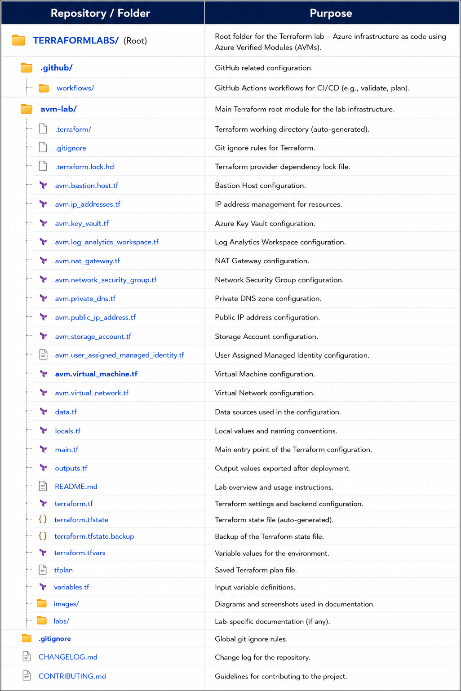

#  Introduction to using Azure Verified Modules for Terraform

### Overall Estimated Duration: 4 Hours 

## 📘 Lab Scenario

Contoso is modernizing its cloud infrastructure by adopting Infrastructure as Code (IaC) to improve consistency, scalability, and operational efficiency across its Azure environments. To accelerate deployments while following Microsoft-recommended best practices, Contoso has chosen to use Azure Verified Modules (AVMs) for Terraform—production-ready, reusable modules that simplify the deployment and management of Azure resources.

In this hands-on lab, you will assume the role of a Cloud Infrastructure Engineer at Contoso. Your task is to build a secure and scalable Azure environment using Terraform and Azure Verified Modules. Beginning with foundational resources such as a Resource Group and Log Analytics Workspace, you will progressively deploy networking, security, storage, and compute resources, including Azure Virtual Network, Key Vault, Storage Account, Azure Bastion, and a Linux Virtual Machine. You will also implement secure authentication using Managed Identity and Azure Key Vault to enable passwordless access to Azure resources while following Infrastructure as Code best practices.

## 📖 Lab Overview

This lab provides a practical introduction to deploying Azure infrastructure using Azure Verified Modules (AVMs) with Terraform. Throughout the exercises, you will configure a complete Infrastructure as Code (IaC) environment and learn how Microsoft-supported AVMs simplify Azure resource deployment while ensuring consistency, security, and maintainability.

You will begin by preparing the Terraform development environment and authenticating with Azure. Next, you will incrementally deploy core Azure services, including a Log Analytics Workspace, Virtual Network, Key Vault, Storage Account, Azure Bastion, and a Linux Virtual Machine using reusable AVMs. Each deployment will be validated through the Azure portal, while the Terraform configurations will be managed using Git and GitHub to simulate a real-world DevOps workflow.

In the final stages, you will securely connect to the deployed virtual machine through Azure Bastion, authenticate using Managed Identity, and interact with Azure Storage by uploading and managing blobs without using storage account keys. By the end of the lab, you will have successfully implemented a secure, modular, and production-ready Azure infrastructure aligned with the cloud engineering practices followed at Contoso.

## 🎯 Objectives

After completing this lab, you will be able to:

* Configure a Terraform development environment for Azure deployments.
* Authenticate Terraform with Azure using the Azure CLI.
* Deploy Azure infrastructure using Azure Verified Modules (AVMs).
* Provision foundational Azure resources, including a Resource Group and Log Analytics Workspace.
* Create and configure Virtual Networks, Subnets, Network Security Groups, and NAT Gateway using AVMs.
* Deploy and configure Azure Key Vault for secure secret management.
* Provision an Azure Storage Account with customer-managed encryption and secure access.
* Deploy a Linux Virtual Machine and Azure Bastion using Terraform modules.
* Securely connect to the virtual machine using Azure Bastion and SSH keys stored in Azure Key Vault.
* Authenticate to Azure from the virtual machine using Managed Identity.
* Upload, download, and manage blobs in Azure Storage using Azure CLI with Managed Identity authentication.
* Execute the Terraform workflow (init, plan, and apply) to provision and manage Azure resources.
* Track infrastructure changes using Git and GitHub version control.
* Apply Infrastructure as Code (IaC) best practices for automation, modularity, scalability, security, and maintainability while building Azure environments at Contoso.

## ⚙️ Prerequisites

Before starting this lab, ensure that you have the following:

* Basic understanding of **Microsoft Azure** services and cloud infrastructure concepts.
* Familiarity with **Infrastructure as Code (IaC)** principles and Terraform fundamentals, including providers, modules, variables, and state files.
* Working knowledge of command-line interfaces such as **PowerShell** or **Bash**.
* Basic understanding of **Git** and version control concepts.
* Access to the **CloudLabs** lab environment with the following preconfigured:
  * Microsoft Azure subscription
  * Azure CLI
  * Terraform CLI (v1.9.x or later)
  * Visual Studio Code
  * Git
  * GitHub account
* Valid Azure and GitHub credentials provided with the lab environment.
 
## 🏗️ Architecture

The architecture leverages Terraform and Azure Verified Modules (AVMs) to provision a secure and scalable Azure infrastructure following Infrastructure as Code (IaC) best practices. A Resource Group serves as the deployment boundary, hosting a Virtual Network with dedicated subnets for Azure Bastion, Virtual Machines, and Private Endpoints. Azure Bastion provides secure browser-based SSH access to the Linux Virtual Machine without exposing public IP addresses.

The solution integrates Azure Key Vault to securely store SSH keys and encryption keys, while Azure Storage Account provides secure object storage for application data. Both services are accessed through Private Endpoints, ensuring that traffic remains within the Azure backbone network. Private DNS Zones enable seamless name resolution for these private endpoints, allowing resources within the Virtual Network to communicate securely using standard Azure service names.

A User Assigned Managed Identity is used to authenticate the Virtual Machine to Azure services without storing credentials, enabling secure access to Key Vault and Storage through Azure Role-Based Access Control (RBAC). Throughout the deployment, Visual Studio Code, Terraform CLI, and Azure CLI are used to develop, provision, and manage the infrastructure, while GitHub is used to version-control the Terraform configurations, resulting in a secure, repeatable, and production-ready Azure environment.

## 🖼️ Architecture Diagram


## 🔍 Explanation of Components

- **Terraform CLI** – Used to initialize, plan, and deploy Azure infrastructure.
- **AzureRM Provider** – Terraform provider used to manage Azure resources.
- **Visual Studio Code** – Used to create and manage Terraform configuration files.
- **Azure CLI** – Used to authenticate and interact with Azure.
- **Azure Virtual Network (VNet)** – Provides private networking for Azure resources.
- **Azure Subnet** – Logical network segment inside a VNet.
- **Azure Network Security Group (NSG)** – Controls inbound and outbound network traffic.
- **Azure Network Interface (NIC)** – Connects Virtual Machines to the network.
- **Azure Linux Virtual Machine** – Compute resource deployed using Terraform.
- **Azure Key Vault** – Securely stores passwords and secrets.
- **Terraform Variables** – Used to parameterize infrastructure configurations.
- **Terraform Modules** – Reusable Terraform configurations used for scalable deployments.

## 📁 Repository Structure



## 🚀 Getting Started with Lab

Welcome to your Introduction to using Azure Verified Modules for Terraform! We've prepared a seamless environment for you to explore Terraform concepts, deploy Azure infrastructure resources, and gain hands-on experience with modern Infrastructure as Code practices.

### Accessing Your Lab Environment

Once you're ready to dive in, your virtual machine and lab guide will be right at your fingertips within your web browser.


### Virtual Machine & Lab Guide

Your virtual machine is your workhorse throughout the workshop. The lab **Guide** is your roadmap to success.

### Exploring Your Lab Resources

To get a better understanding of your lab resources and credentials, navigate to the **Environment** tab.


### Utilizing the Split Window Feature

For convenience, you can open the lab guide in a separate window by selecting the **Split Window** button from the top right corner.


### Managing Your Virtual Machine

Feel free to **Start, Restart, or Stop** your virtual machine as needed from the **Resources** tab. Your experience is in your hands!


### Lab Guide Zoom In/Zoom Out

To adjust the zoom level for the environment page, click the **A↕** icon located next to the timer in the lab environment.


### Resize the Virtual Machine View

Use the **slider (three vertical dots)** located between the **Virtual Machine** and the **Lab Guide** panes to adjust the display size, allowing you to customize the layout based on your preference.


## ☁️ Login to Azure portal

1. On your virtual machine, click on the **Azure Portal** icon as shown below:

   

1. On the Sign in to Microsoft Azure tab you will see the login screen, in that enter the following email/username and click **Next**.

   - **Email/Username:** <inject key="AzureAdUserEmail"></inject>

     

1. Now enter the following password and click **Sign in**.

   - **Temporary Access Pass:** <inject key="AzureAdUserPassword"></inject>

     

1. If you see the pop-up **Stay Signed in?**, click **Yes**.

   

1. If a Welcome to Microsoft Azure pop-up window appears, simply click **Maybe later** to skip the tour.


### Login to GitHub

1. In the **Lab VM**, open the **Microsoft Edge** browser from the desktop.

   

1. Navigate to the **GitHub login** page by copying and pasting the following URL into the address bar:

   ```
   https://github.com/login
   ```

1. On the **Sign in to GitHub** tab, enter the provided **GitHub username** in the input field, and click on **Sign in with your identity provider** **(2)**.

    - Email/Username: <inject key="GitHub User Name" enableCopy="true"/> **(1)**

       

1. Click on **Continue** on the **Single sign-on to CloudLabs Organizations** page to proceed.

   

1. You will see a **Pop-up** to request the **Permissions**, click **Accept**.

   

1. In case you see the **Sign in** tab. Here, enter your Azure Entra ID credentials and click **Next (2)**.

   - **Email/Username:** <inject key="AzureAdUserEmail"></inject> **(1)**

     

1. Next, provide your Temporary Password and click on **Sign in (2)**

   - **Temporary Access Pass:** <inject key="AzureAdUserPassword"></inject> **(1)**

     

1. On the **Stay Signed in?** pop-up, click on No.

   

1. You are now successfully signed in to **GitHub** and redirected to the **GitHub home page**. Click your **Repository** to open it.

   

## 📞 Support Contact

The CloudLabs support team is available 24/7, 365 days a year, via email and live chat to ensure seamless assistance at any time. We offer dedicated support channels tailored specifically for both learners and instructors, ensuring that all your needs are promptly and efficiently addressed.

Learner Support Contacts:

- Email Support: cloudlabs-support@spektrasystems.com
- Live Chat Support: https://cloudlabs.ai/labs-support

Now, click **Next** from the lower right corner to move on to the next page.


### Happy Learning!!
