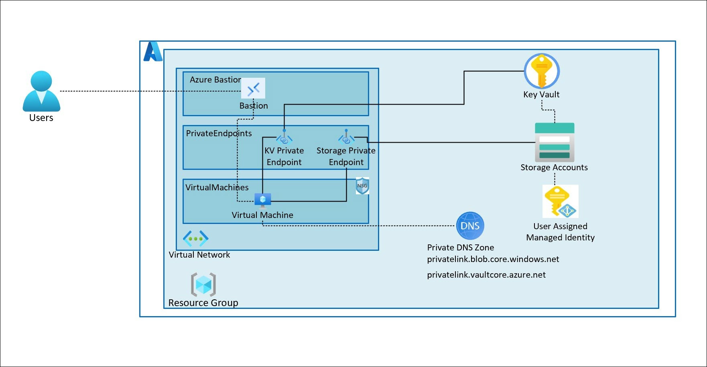
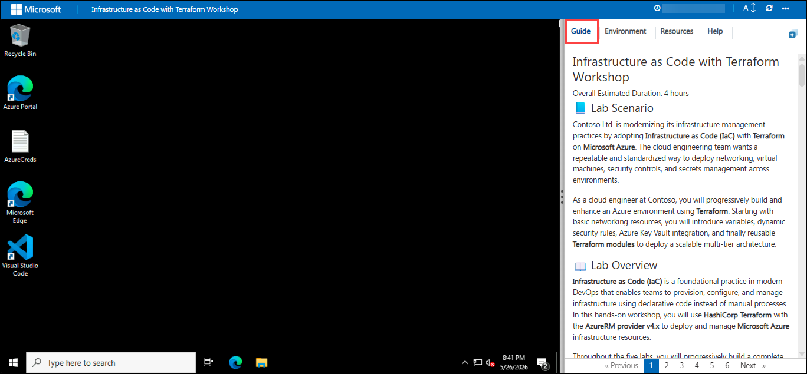
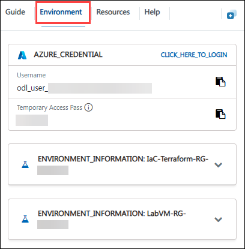
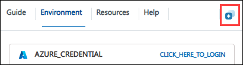
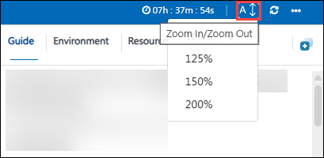
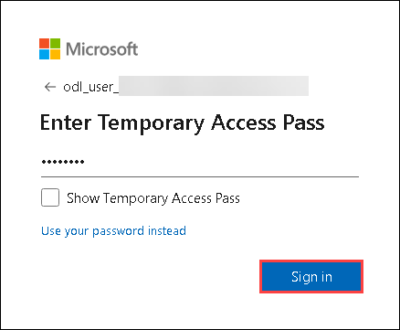
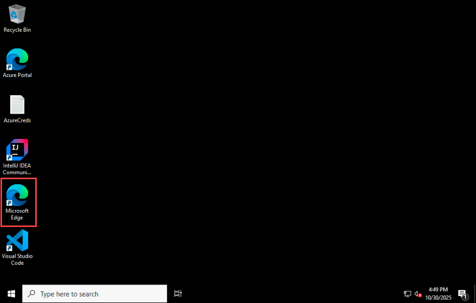
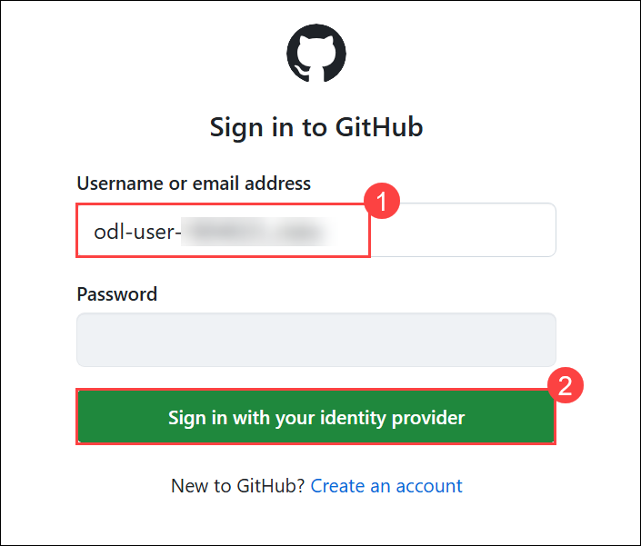
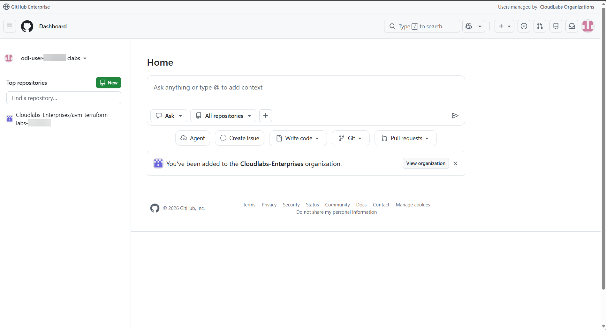

#  Introduction to using Azure Verified Modules for Terraform

### Overall Estimated Duration: 4 Hours 

## 📘 Lab Scenario


## 📖 Lab Overview


## 🎯 Objectives


## ⚙️ Prerequisites


## 🏗️ Architecture


## 🖼️ Architecture Diagram



## 🔍 Explanation of Components

- **Terraform CLI** – Used to initialize, plan, and deploy Azure infrastructure.
- **AzureRM Provider** – Terraform provider used to manage Azure resources.
- **Visual Studio Code** – Used to create and manage Terraform configuration files.
- **Azure CLI** – Used to authenticate and interact with Azure.
- **Azure Virtual Network (VNet)** – Provides private networking for Azure resources.
- **Azure Subnet** – Logical network segment inside a VNet.
- **Azure Network Security Group (NSG)** – Controls inbound and outbound network traffic.
- **Azure Network Interface (NIC)** – Connects Virtual Machines to the network.
- **Azure Linux Virtual Machine** – Compute resource deployed using Terraform.
- **Azure Key Vault** – Securely stores passwords and secrets.
- **Terraform Variables** – Used to parameterize infrastructure configurations.
- **Terraform Modules** – Reusable Terraform configurations used for scalable deployments.

## 🚀 Getting Started with Lab

Welcome to your Introduction to using Azure Verified Modules for Terraform! We've prepared a seamless environment for you to explore Terraform concepts, deploy Azure infrastructure resources, and gain hands-on experience with modern Infrastructure as Code practices.

### Accessing Your Lab Environment

Once you're ready to dive in, your virtual machine and lab guide will be right at your fingertips within your web browser.



### Virtual Machine & Lab Guide

Your virtual machine is your workhorse throughout the workshop. The lab **Guide** is your roadmap to success.

### Exploring Your Lab Resources

To get a better understanding of your lab resources and credentials, navigate to the **Environment** tab.



### Utilizing the Split Window Feature

For convenience, you can open the lab guide in a separate window by selecting the **Split Window** button from the top right corner.



### Managing Your Virtual Machine

Feel free to **Start, Restart, or Stop** your virtual machine as needed from the **Resources** tab. Your experience is in your hands!


### Lab Guide Zoom In/Zoom Out

To adjust the zoom level for the environment page, click the **A↕** icon located next to the timer in the lab environment.



## ☁️ Login to Azure portal

1. On your virtual machine, click on the **Azure Portal** icon as shown below:

   

1. On the Sign in to Microsoft Azure tab you will see the login screen, in that enter the following email/username and click **Next**.

   - **Email/Username:** <inject key="AzureAdUserEmail"></inject>

     

1. Now enter the following password and click **Sign in**.

   - **Temporary Access Pass:** <inject key="AzureAdUserPassword"></inject>

     

1. If you see the pop-up **Stay Signed in?**, click **Yes**.

   

1. If a Welcome to Microsoft Azure pop-up window appears, simply click **Maybe later** to skip the tour.

### Resize the Virtual Machine View

Use the **slider (three vertical dots)** located between the **Virtual Machine** and the **Lab Guide** panes to adjust the display size, allowing you to customize the layout based on your preference.


### Login to GitHub

1. In the **Lab VM**, open the **Microsoft Edge** browser from the desktop.

   

1. Navigate to the **GitHub login** page by copying and pasting the following URL into the address bar:

   ```
   https://github.com/login
   ```

1. On the **Sign in to GitHub** tab, enter the provided **GitHub username** in the input field, and click on **Sign in with your identity provider** **(2)**.

    - Email/Username: <inject key="GitHub User Name" enableCopy="true"/> **(1)**

       

1. Click on **Continue** on the **Single sign-on to CloudLabs Organizations** page to proceed.

   

1. You'll see the **Sign in** tab. Here, enter your Azure Entra credentials and click **Next (2)**.

   - **Email/Username:** <inject key="AzureAdUserEmail"></inject> **(1)**

     

1. Next, provide your Temporary Password and click on **Sign in (2)**

   - **Temporary Access Pass:** <inject key="AzureAdUserPassword"></inject> **(1)**

     

1. On the **Stay Signed in?** pop-up, click on No.

   

1. You are now successfully logged in to **GitHub** and have been redirected to the **GitHub homepage**.

   

## 📞 Support Contact

The CloudLabs support team is available 24/7, 365 days a year, via email and live chat to ensure seamless assistance at any time. We offer dedicated support channels tailored specifically for both learners and instructors, ensuring that all your needs are promptly and efficiently addressed.

Learner Support Contacts:

- Email Support: cloudlabs-support@spektrasystems.com
- Live Chat Support: https://cloudlabs.ai/labs-support

Now, click **Next** from the lower right corner to move on to the next page.


### Happy Learning!!
