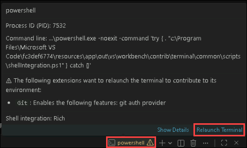
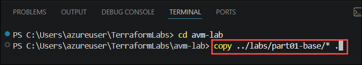

# Exercise 1: Preparing the Terraform Environment and Deploying the Base Infrastructure with Azure Verified Modules

### Estimated Duration: 60 Minutes

## 📘 Scenario

As a Cloud Infrastructure Engineer at Contoso, you have been tasked with establishing the organization's foundational Azure infrastructure using Azure Verified Modules (AVMs) for Terraform. To ensure consistency, security, and scalability across deployments, Contoso has standardized on Infrastructure as Code (IaC) practices and reusable, Microsoft-validated Terraform modules.

In this exercise, you will prepare the Terraform development environment, authenticate to Azure, and deploy the base infrastructure — a Resource Group and a Log Analytics Workspace — using your first Azure Verified Module. The Log Analytics Workspace will serve as the central destination for diagnostic logs and metrics from every resource Contoso deploys in the exercises that follow.

## 📖 Overview

In this exercise, you will configure the local Terraform development environment and use Azure Verified Modules (AVMs) to deploy Contoso's base Azure infrastructure. You will begin by verifying the required tools in Visual Studio Code, confirming the Terraform CLI installation, and authenticating to Azure. Next, you will set up the Terraform root module and examine its core configuration files — including providers, local values, variables, and outputs — to understand how consistent resource naming and reusable values are defined. You will then deploy a Resource Group and a Log Analytics Workspace using the AVM modules, following the standard Terraform workflow of init, plan, and apply.

Throughout the exercise, you will validate the deployment in the Azure portal and initialize a Git repository to version-control your Terraform configuration, pushing your first commit to GitHub. By the end of the exercise, you will have a working development environment and the monitoring foundation required for the remaining lab activities.

## 🎯 Objectives

In this exercise, you will complete the following tasks:

- Task 1: Prepare the Terraform Development Environment
- Task 2: Deploy the Base Infrastructure

## Task 1: Prepare the Terraform Development Environment

In this task, you will prepare the local development environment required for Terraform deployments in Visual Studio Code, install the required extensions, and verify that Terraform is installed.

1. Open **Visual Studio Code** on your Lab-VM.

   

1. Once the IDE opens, if you see the ***Welcome to VS Code*** sign-in pop-up for GitHub, simply close the window by clicking the **X** in the upper-right corner.

   

1. In VS Code, ensure that the following extensions are installed:
   
   - [HashiCorp Terraform](https://marketplace.visualstudio.com/items?itemName=HashiCorp.terraform) — syntax highlighting, validation, and IntelliSense for `.tf` files.
  
     

1. From the **File** menu in VS Code, choose **Open Folder**.

   

1. Navigate to `C:\Users\azureuser`, select the **TerraformLabs** folder and then click **Select folder**.

   

1. Open the integrated terminal by selecting **Terminal → New Terminal**.

   

1. Now you will see another screen Do you trust the authors of the files in this folder?. Click **Trust Folder & Continue**.

   

1. If you see a yellow warning in the **PowerShell** terminal, hover your cursor over it, click **Relaunch Terminal**.

   

1. In the integrated terminal, verify that Terraform is installed by running the following command:

   ```bash
   terraform version
   ```

   This command displays the currently installed Terraform CLI version. You should see **Terraform version 1.9.x** or later installed in the environment.

   

1. Sign in to Azure from the integrated terminal:

   ```
   az login
   ```

1. On the *Let’s get you signed in pop-up*, select **Work or school account**, then click **Continue**. You may need to minimize any open applications to bring this window into view.

   

1. You'll see the Sign into Microsoft Azure tab. Here, enter your credentials:

   - **Email/Username:** <inject key="AzureAdUserEmail"></inject>
  
     
  
1. Next, enter the Temporary Access Pass:

   - **Temporary Access Pass:** <inject key="AzureAdUserPassword"></inject>
  
     

1. On the *Sign in to all apps, websites, and services on this device?*, click **No, this app only**.

   

1. You are now signed in to the Azure portal from your Visual Studio Code terminal. In Visual Studio Code integrated terminal, when prompted to select a subscription and tenant, press **Enter** to accept the default selection.

   

## Task 2: Deploy the Base Infrastructure

In this part we are going to setup our Terraform root module and deploy an Azure Resource Group and Log Analytics Workspace ready for the rest of the lab. In this part we introduce our first Azure Verified Module, the `avm.log_analytics_workspace` module.

> **Important:** Do not clear or close the PowerShell terminal, as doing so may interrupt the Terraform session and affect the remaining lab tasks.

The Log Analytics Workspace is used as the target for diagnostic settings for all our other resources. This is where we are sending our logging telemetry.

1. In the **New Terminal**, run the following command to create a new directory named **avm-lab**.

   ```pwsh
   mkdir avm-lab
   ```

   

1. Navigate to the directory `avm-lab`.

   ```pwsh
   cd avm-lab
   ```

   

1. Copy the files from the **Part 1** folder into the **avm-lab** folder by running the following command:

      ```pwsh
      copy ../labs/part01-base/* .
      ```
   
   

   -  Your file structure should look like this:

      ```plaintext
      📂terraformlabs
      ┣ 📂avm-lab
      ┃ ┣ 📜.gitignore
      ┃ ┣ 📜avm.log_analytics_workspace.tf
      ┃ ┣ 📜locals.tf
      ┃ ┣ 📜main.tf
      ┃ ┣ 📜outputs.tf
      ┃ ┣ 📜terraform.tf
      ┃ ┗ 📜variables.tf
      ```
   -  Expand the **avm-lab** directory by clicking the dropdown arrow next to it to view the **Terraform** files.

      

1. Examine the `terraform` block in `terraform.tf` and note that we are referencing the `azurerm` and `random` providers.

   

   | Concept | Description |
   |:--------|:------------|
   | **AzureRM Provider (azurerm)** | The Azure Resource Manager provider enables Terraform to create, update, and manage Azure resources such as Virtual Networks, Virtual Machines, Storage Accounts, and Key Vaults. |
   | **Random Provider (random)** | Provides utilities to generate random values such as strings, passwords, integers, and unique resource names. It does not create Azure resources. | 

1. Examine the files below: 

   * `locals.tf`

     

      | Concept | Description |
      |:--------|:------------|
      | **locals** | Defines reusable local values that can be referenced throughout the Terraform configuration, reducing duplication and improving consistency. |
      | **name_replacements** | Creates a collection of values that will be substituted into the resource naming templates. |
      | **workload** | Represents the application or workload name (for example, demo) that becomes part of the Azure resource names. |
      | **environment** | Represents the deployment environment (for example, dev, test, or prod) and is included in the resource names to distinguish environments. | 
      | **location** | Specifies the Azure region (for example, swedencentral or eastus) that is incorporated into the resource names. | 
      | **sequence** | Generates a three-digit sequence number (for example, 001, 002, 003) using the format ("%03d", ...) function to ensure unique and consistently formatted resource names. |
      | **resource_names** | Generates the final resource names by replacing the placeholders in the resource name templates with the values defined in name_replacements. | 

   * `variables.tf` 
   
     

      | Concept | Description |
      |:--------|:------------|
      | **variable "location"** | Defines the Azure region where all resources will be deployed (for example, swedencentral or eastus).|
      | **type = string** | Specifies that the variable accepts a text value.|
      | **validation** | Ensures the value entered for the variable follows the required format before Terraform executes.|
      | **variable "resource_name_workload"** | Defines the workload name that is used as part of the Azure resource naming convention.|
      | **default = "demo"** | Assigns a default workload name if no value is provided by the user.|

   * `outputs.tf`

     

      | Concept | Description |
      |:--------|:------------|
      | **output "resource_names"** | Displays the names of the Azure resources created by Terraform after the deployment completes.|
      | **local.resource_names** | Retrieves the generated resource names from the locals.tf file.|
      | **output "resource_ids"** | Displays the Azure Resource IDs of the deployed resources after the deployment completes.|
      | **module.resource_group.resource_id** | Returns the Resource ID of the deployed Resource Group.|
      | **module.log_analytics_workspace.resource_id** | Returns the Resource ID of the deployed Log Analytics Workspace.|

   * `main.tf`

     

      | Concept | Description |
      |:--------|:------------|
      | **module "resource_group"** | Uses the Azure Verified Module (AVM) to deploy an Azure Resource Group.|
      | **source** | Specifies the Terraform Registry location of the Azure Verified Module used to create the Resource Group.|
      | **version** | Specifies the version of the AVM module to ensure a consistent deployment.|
      | **location = var.location** | Deploys the Resource Group in the Azure region specified by the location variable.|
      | **name = local.resource_names.resource_group_name** | Assigns the Resource Group name generated in the locals.tf file.|
      | **tags = var.tags** | Applies the user-defined tags to the Resource Group for easier organization and management.|

1. Examine the `avm.log_analytics_workspace.tf` file and note the `source` and `version` properties.

   

      | Concept | Description |
      |:--------|:------------|
      | **source** | Specifies the Terraform Registry location of the Azure Verified Module (AVM) that Terraform downloads and uses to deploy the Log Analytics Workspace.|
      | **version** | Specifies the version of the AVM module to use, ensuring a consistent and predictable deployment by avoiding unexpected changes from newer module versions.|

1. Create an environment variable to set the location variable:

      ```pwsh
      $env:TF_VAR_location = "<azure region>"
      ```

1. Replace `<azure region>` with a valid Azure location of your choice (e.g. eastus,centralus,canadaeast,westus).

      ```pwsh
      $env:TF_VAR_location = "eastus"
      ```

         

1. Navigate to the left side of the Visual Studio, and select **File (1)**, and click on **New File (2)**.

   

1. In the Search bar, give the name as **terraform.tfvars** and press **Enter**.

   ```
   terraform.tfvars
   ```

   

1. In the Create New File dialog box, verify that the file name is terraform, ensure the file is created in the `C:\Users\azureuser\TerraformLabs\avm-lab` directory, and then click Create File.

   

1. After the file is created, add the following code to it, and save the file `Ctrl + S`.

      ```hcl
      tags = {
        type = "avm"
        env  = "demo"
      }
      ```

      

1. Run the following command to initialize the Terraform configuration.

   ```
   terraform init
   ```
   
   - You should see: `Terraform has been successfully initialized!`

     

1. Run the following command to preview the resources that will be created and generate a Terraform plan file.

   ```
   terraform plan -out tfplan
   ```
   Expected output:

   ```
   Plan: 6 to add, 0 to change, 0 to destroy.
   ```

      

   >**Note**: Scroll up in the **Terminal** to view the command output.

1. Run the following command to create the resources based on the generated Terraform plan file.

   ```
   terraform apply tfplan
   ```

   

   >**Note**: The **terraform apply tfplan** command applies the execution plan saved in the **tfplan file** and deploys the Azure resources exactly as defined in the previously generated Terraform plan.

   Expected output:

   ```
   Apply complete! Resources: 6 added, 0 changed, 0 destroyed.
   ```

   

   >**Note**: Scroll up in the **Terminal** to view the command output.

1. Take note of the outputs from the `terraform apply` command, they should look like this:

   

1. Navigate to the Azure portal. In the search bar, type **Log Analytics workspace (1)**, and then select **Log Analytics workspaces (2)** from the search results.

   

1. Verify that the newly created **Log Analytics Workspace** resource is visible in the Azure portal.

   

1. Configure your **Git Author** identity by following the on-screen instructions before proceeding.

    ```
    git config --global user.name odl-user-<inject key="Deployment-ID" enableCopy="false"/>
    ```

    ```pwsh
    git config --global user.email <inject key="AzureAdUserEmail"></inject>
    ```

    

1. Run the following command to initialize a new Git repository with the default branch set to main.

   ```
   git init -b main
   ```

   

1. Navigate to the **GitHub repository** in your browser. Copy the **GitHub repository URL** from the browser's address bar. You will use this URL to configure the repository in **Visual Studio Code**.

   

1. Use the copied GitHub repository URL to add the remote repository.

   ```
   git remote add origin https://github.com/Cloudlabs-Enterprises/avm-terraform-labs-<inject key="Deployment-ID" enableCopy="false"/>
   ```

   

1. Run the following command to stage all the files for commit.

   ```
   git add .
   ```

   

1. Run the following command to commit the staged files to the Git repository.

   ```
   git commit -m "Initial commit"
   ```

   

1. Run the command to upload the files to GitHub repository

   >**Note:** The CloudLabs GitHub repository is pre-populated with an initial `README.md` commit. Therefore, use `--force` for the first push to replace the default repository contents with your local repository.

   ```pwsh
   git push --force -u origin main
   ```

   

1. If a prompt appears asking you to connect to GitHub after running the command, click **Sign in with your browser** to continue.

   

1. If the Authorize Git Credential Manager pop-up appears, click **Authorize git-ecosystem** to continue.

   

1. Refresh the **GitHub repository** page, and review the files in the repository.

   

## 🧾 Summary

In this exercise, you completed the following:

* Prepared the Terraform development environment in Visual Studio Code and verified the Terraform CLI installation.
* Authenticated with Azure and configured the target subscription for the deployment.
* Examined the Terraform root module, including providers, local values, variables, and outputs used for consistent resource naming.
* Initialized the Terraform configuration and deployed a Resource Group and Log Analytics Workspace using Azure Verified Modules (AVM).
* Validated the deployed resources in the Azure portal to confirm successful deployment.
* Initialized a Git repository, committed the Terraform configuration, and pushed the initial commit to GitHub.

---

You have successfully completed the lab. Click **Next >>** in the lower-right corner to proceed to the next lab.


