# Exercise 1: Set Up the Azure Infrastructure Using Azure Verified Modules

### Estimated Duration:

## 📘 Scenario


## 📖 Overview


## 🎯 Objectives

You will be able to complete the following tasks:

- Task 1 - Prepare the Terraform Development Environment
- Task 2 - Base files and resources
- Task 3 - Virtual network and subnets
- Task 4 - Key Vault
- Task 5 - Storage account

## Task 1: Prepare the Terraform Development Environment

In this task, you will prepare the local development environment required for Terraform deployments in Visual Studio Code, install the required extensions, and verify that Terraform is installed.

1. Open **Visual Studio Code** on your Lab-VM.

   

1. Once the IDE opens, if you see the ***Welcome to VS Code*** sign-in pop-up for GitHub, simply close the window by clicking the **X** in the upper-right corner.

   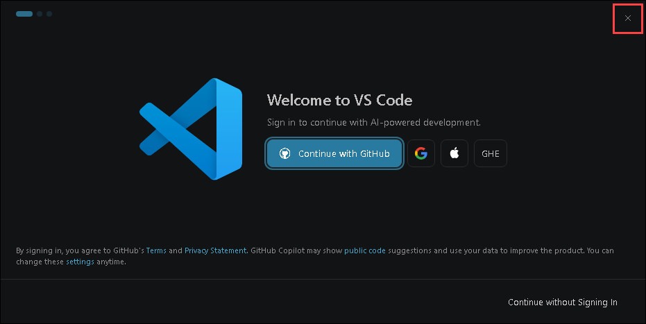

1. In VS Code, ensure that the following extensions are installed:
   
   - [HashiCorp Terraform](https://marketplace.visualstudio.com/items?itemName=HashiCorp.terraform) — syntax highlighting, validation, and IntelliSense for `.tf` files.
  
     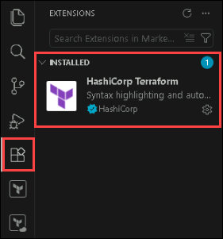

1. From the **File** menu in VS Code, choose **Open Folder**.

   

1. Navigate to `C:\Users\azureuser`, select the **TerraformLabs** folder and then click **Select folder**.

   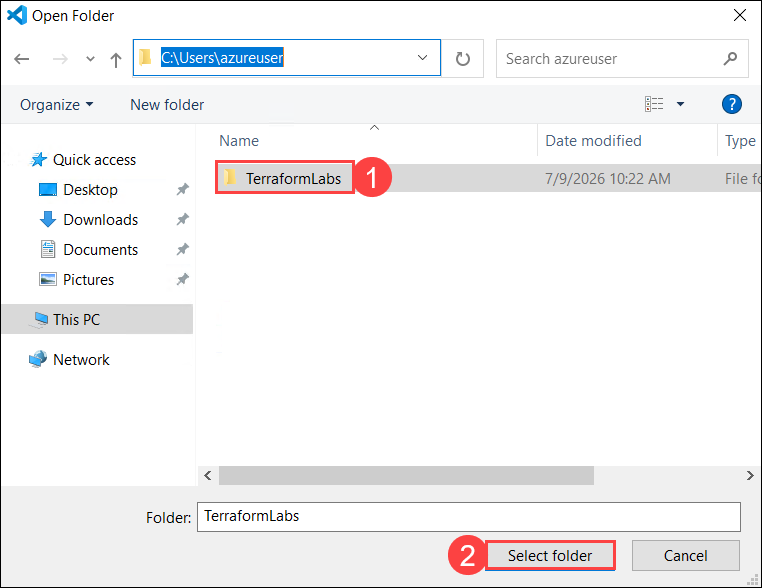

1. Now you will see another screen Do you trust the authors of the files in this folder?. Select the **checkbox (1)** *Trust the authors of all files in the parent folder 'azureuser'* and then click **Yes, I trust the authors (2)**.

   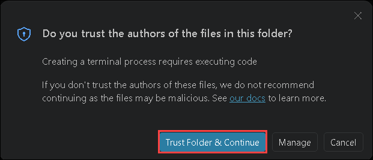

1. Open the integrated terminal by selecting **Terminal → New Terminal**.

   

1. In the integrated terminal, verify that Terraform is installed by running the following command:

   ```bash
   terraform version
   ```

   This command displays the currently installed Terraform CLI version. You should see **Terraform version 1.9.x** or later installed in the environment.

   

1. Copy the GitHub Repository link from the GitHub page URL, to set the GitHub repo in the Visual Studio Code.

   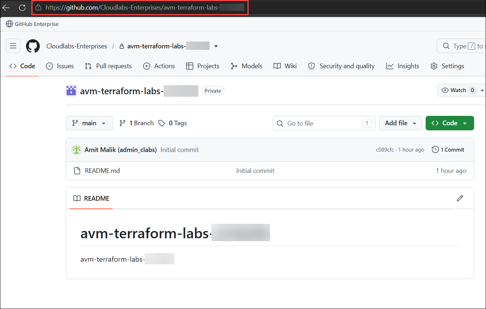

1. Use the URL to set the remote URL to the required Repository.

   ```
   git remote set-url origin https://github.com/Cloudlabs-Enterprises/avm-terraform-labs-<inject key="Deployment-ID" enableCopy="false"/>
   ```

   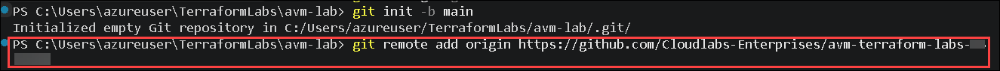

1. Sign in to Azure from the integrated terminal:

   ```
   az login
   ```

1. On the *Let’s get you signed in pop-up*, select **Work or school account**, then click **Continue**. You may need to minimize any open applications to bring this window into view.

   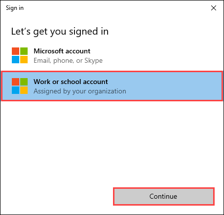

1. You'll see the Sign into Microsoft Azure tab. Here, enter your credentials:

   - **Email/Username:** <inject key="AzureAdUserEmail"></inject>
  
     
  
1. Next, enter the Temporary Access Pass:

   - **Temporary Access Pass:** <inject key="AzureAdUserPassword"></inject>
  
     

1. On the *Sign in to all apps, websites, and services on this device?*, click **No, this app only**.

   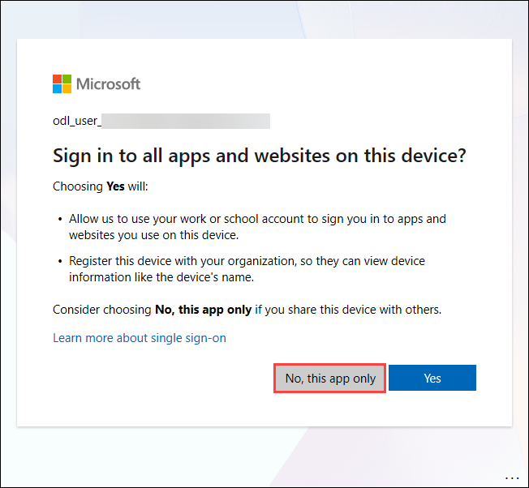

1. You are now signed in to the Azure portal from your Visual Studio Code terminal. In Visual Studio Code integrated terminal, when prompted to select a subscription and tenant, press **Enter** to accept the default selection.

   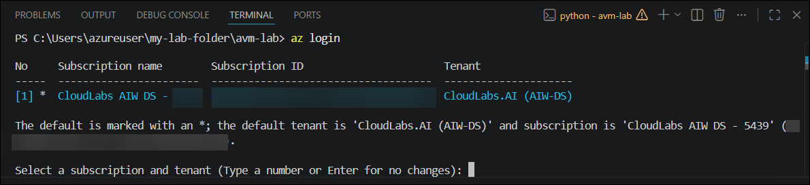

## Task 2 - Base files and resources

In this part we are going to setup our Terraform root module and deploy an Azure Resource Group and Log Analytics Workspace ready for the rest of the lab. In this part we introduce our first Azure Verified Module, the `avm-res-log-analytics-workspace` module.

The Log Analytics Workspace is used as the target for diagnostic settings for all our other resources. This is where we are sending our logging telemetry.

1. In the **New Terminal**, create a new directory:

   ```pwsh
   mkdir avm-lab
   ```

   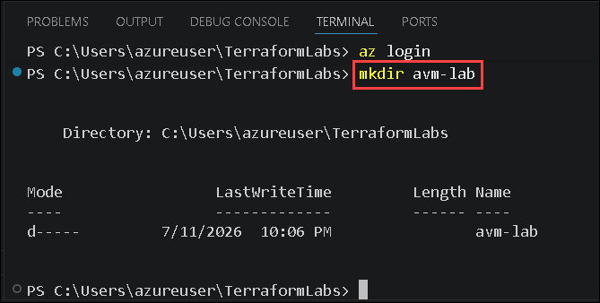

1. Navigate to the directory `avm-lab`.

   ```pwsh
   cd avm-lab
   ```

   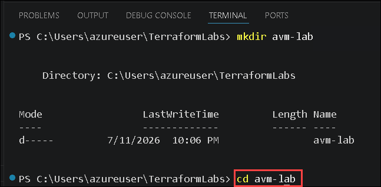

1. Copy the files from the **Part 1** folder into the `avm-lab` folder.

      ```pwsh
      copy ../labs/part01-base/* .
      ```

1. In the Visual studio code, navigate to the directory `cd C:\Users\azureuser\TerraformLabs\labs\part01-base`

   -  Your file structure should look like this:

      ```plaintext
      📂terraformlabs
      ┣ 📂avm-lab
      ┃ ┣ 📜.gitignore
      ┃ ┣ 📜avm.log_analytics_workspace.tf
      ┃ ┣ 📜locals.tf
      ┃ ┣ 📜main.tf
      ┃ ┣ 📜outputs.tf
      ┃ ┣ 📜terraform.tf
      ┃ ┗ 📜variables.tf
      ```
   -  Expand the **avm-lab** directory by clicking the dropdown arrow next to it to view the **Terraform** files.

      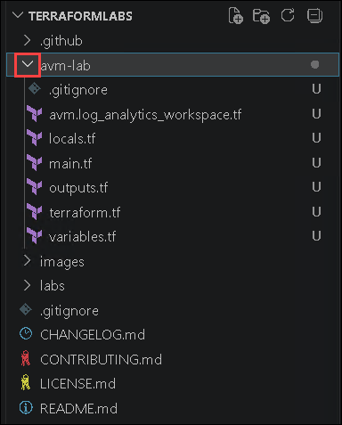

1. Examine the `terraform` block in `terraform.tf` and note that we are referencing the `azurerm` and `random` providers.

   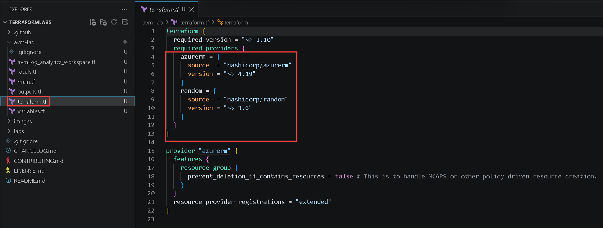

1. Examine the files below: 

   * `locals.tf`

     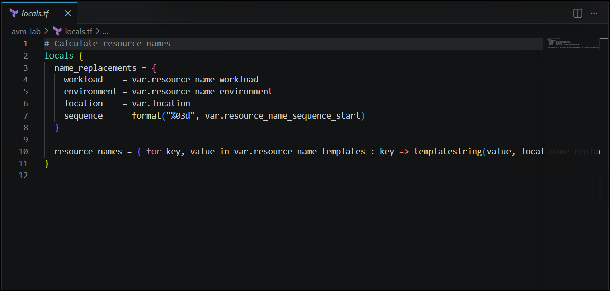

   * `variables.tf` 
   
     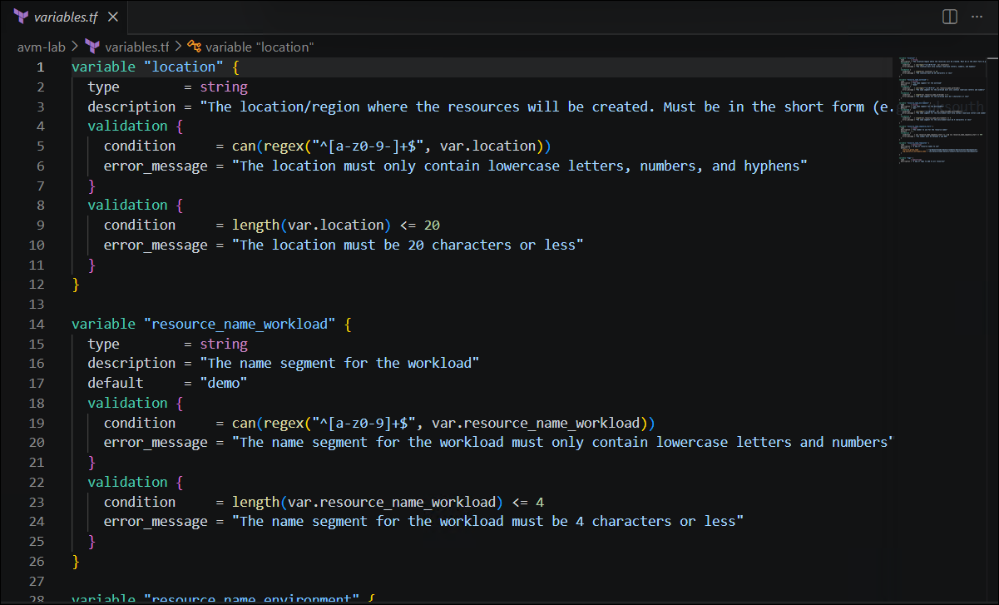

   * `outputs.tf`

     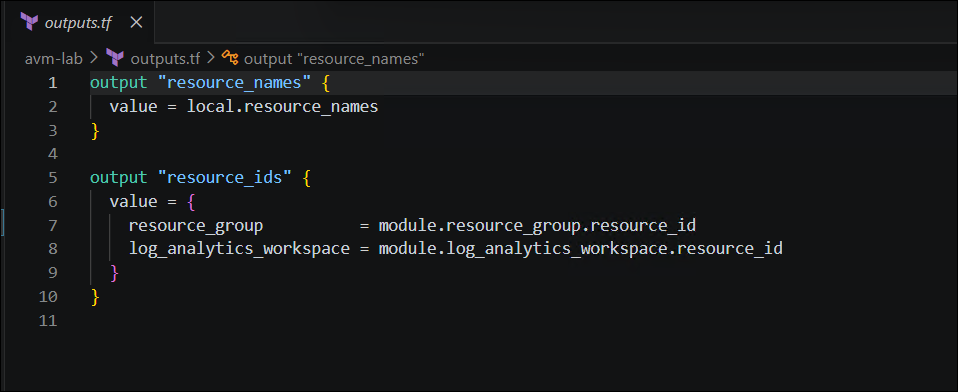

   * `main.tf`

     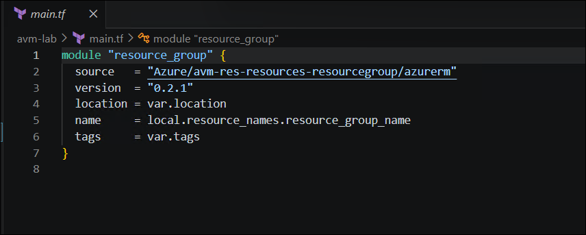

1. Examine the `avm.log_analytics_workspace.tf` file and note the `source` and `version` properties.

   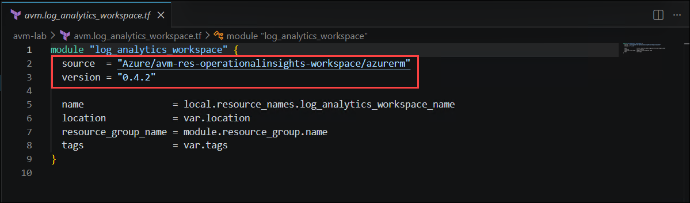

1. Create an environment variable to set the location variable:

      ```pwsh
      $env:TF_VAR_location = "<azure region>"
      ```

1. Replace `<azure region>` with a valid Azure location of your choice (e.g. eastus,eastus2,centralus,canadaeast,westus,westus3).

      ```pwsh
      $env:TF_VAR_location = "eastus"
      ```

      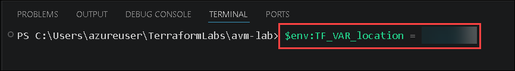   

1. Navigate to the left side of the Visual Studio, and select **File (1)**, and click on **New File (2)**.

   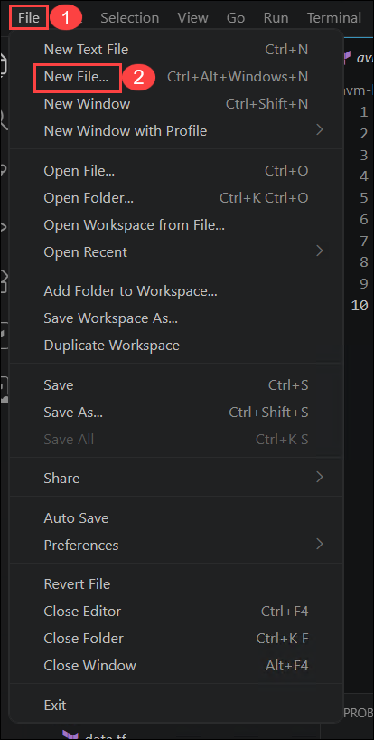

1. In the Search bar, give the name as **terraform.tfvars** and press **Enter**.

   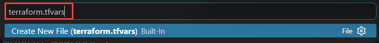

1. In the Create New File dialog box, verify that the file name is terraform, ensure the file is created in the `C:\Users\azureuser\TerraformLabs\avm-lab` directory, and then click Create File.

   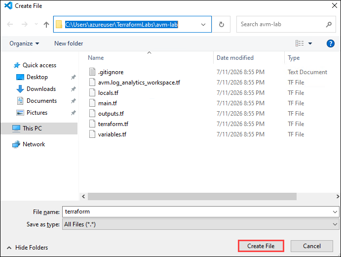

1. After the file is created, add the following code to it, and save the file `Ctrl + S`.

      ```hcl
      tags = {
        type = "avm"
        env  = "demo"
      }
      ```

      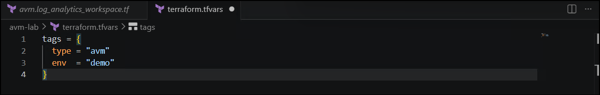

1. Run the following command to initialize the Terraform configuration.

   ```
   terraform init
   ```
   
   - You should see: `Terraform has been successfully initialized!`

     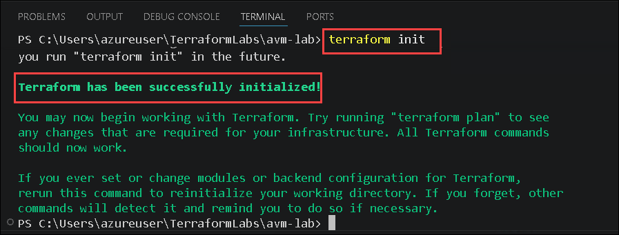

1. Run the following command to preview the resources that will be created and generate a Terraform plan file.

   ```
   terraform plan -out tfplan
   ```

   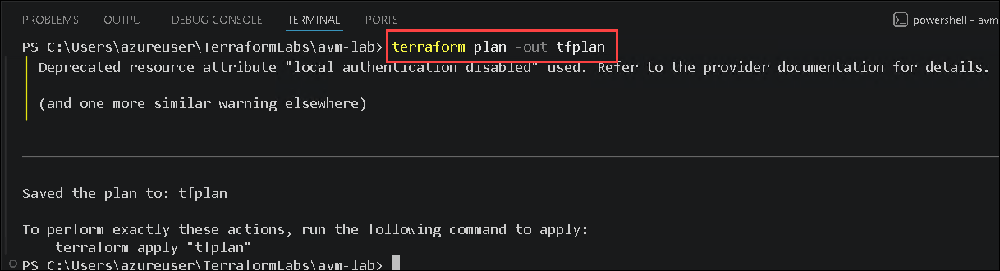   

1. Run the following command to create the resources based on the generated Terraform plan file.

   ```
   terraform apply tfplan
   ```

   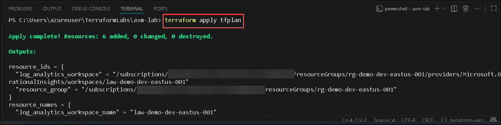

   Expected output:

   ```
   Apply complete! Resources: 6 added, 0 changed, 0 destroyed.
   ```

   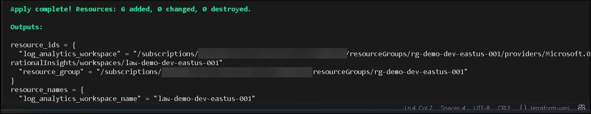

1. Take note of the outputs from the `terraform apply` command, they should look like this:

   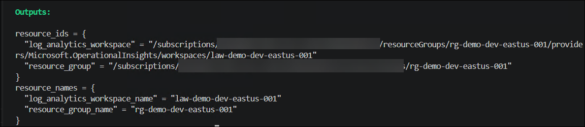

1. Navigate to the Azure portal. In the search bar, type **Log Analytics workspace (1)**, and then select **Log Analytics workspaces (2)** from the search results.

   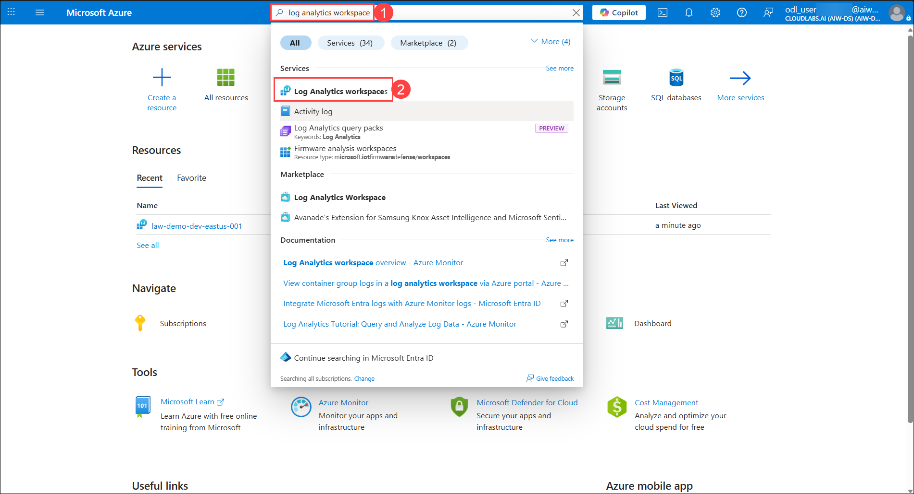

1. Click on the newly created **Log Analytics workspace** resource.

   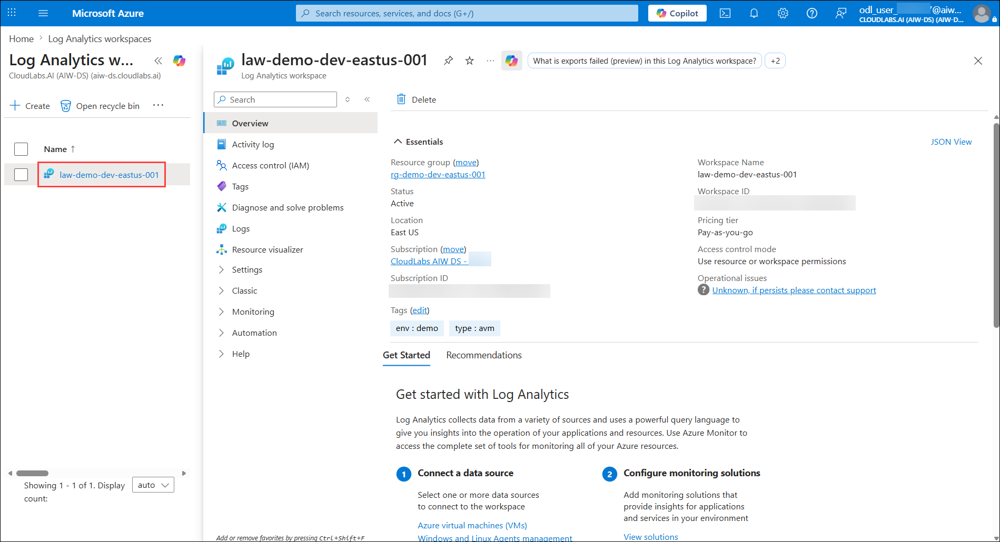

1. Run the following command to initialize a new Git repository with the default branch set to main.

   ```
   git init -b main
   ```

   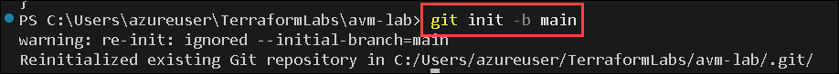

1. Run the following command to stage all the files for commit.

   ```
   git add .
   ```

   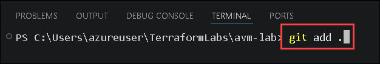

1. Run the following command to commit the staged files to the Git repository.

   ```
   git commit -m "Initial commit"
   ```

   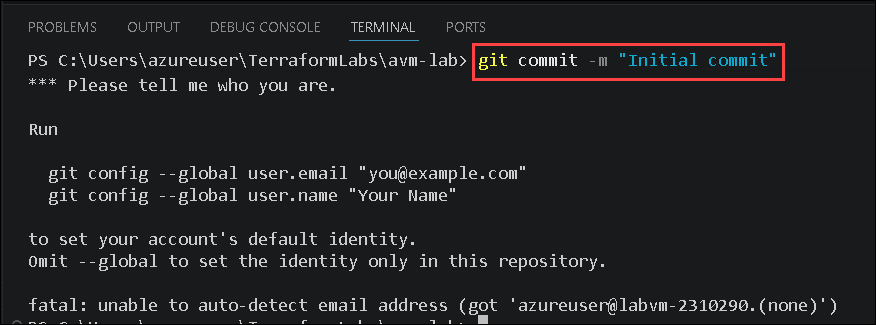

1. If you are prompted to set up a Git Author identity, follow the instructions and then re-run the `git commit` command.

    ```pwsh
    git config --global user.email <inject key="GitHub User Name" enableCopy="true"/>
    git config --global user.name odl-user-<inject key="Deployment-ID" enableCopy="false"/>
    ```

    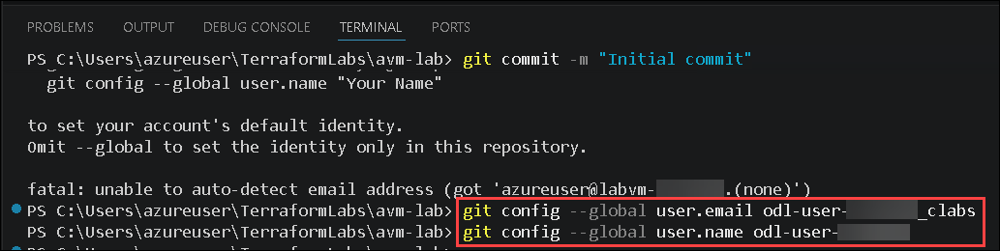

1. Re-run the git commit cmd:

   ```
   git commit -m "Initial commit"
   ```

   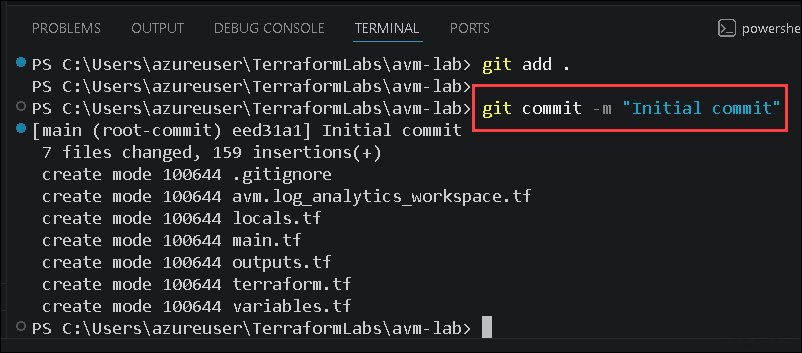

1. Run the command to upload the files to GitHub repository

   ```pwsh
   git push origin main
   ```

   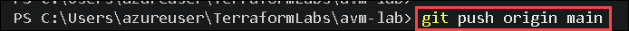

1. After executing the above command, you will get a pop-up to connect to GitHub, click **Sign in with your browser**.

   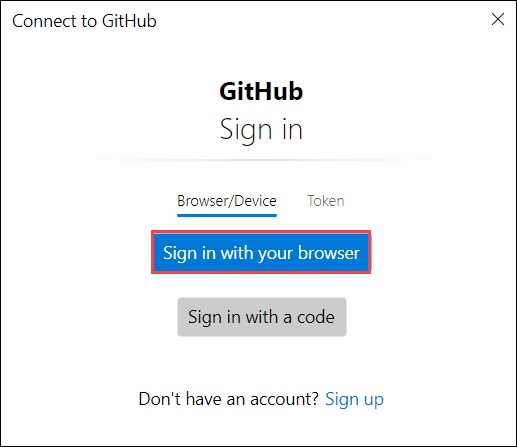

1. On the **Authorize Git Credential Manager** pop-up, click **Authorize git-ecosystem**.

   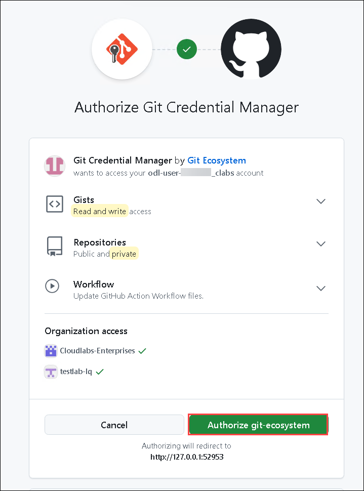

1. Review the files the GitHub repository.

   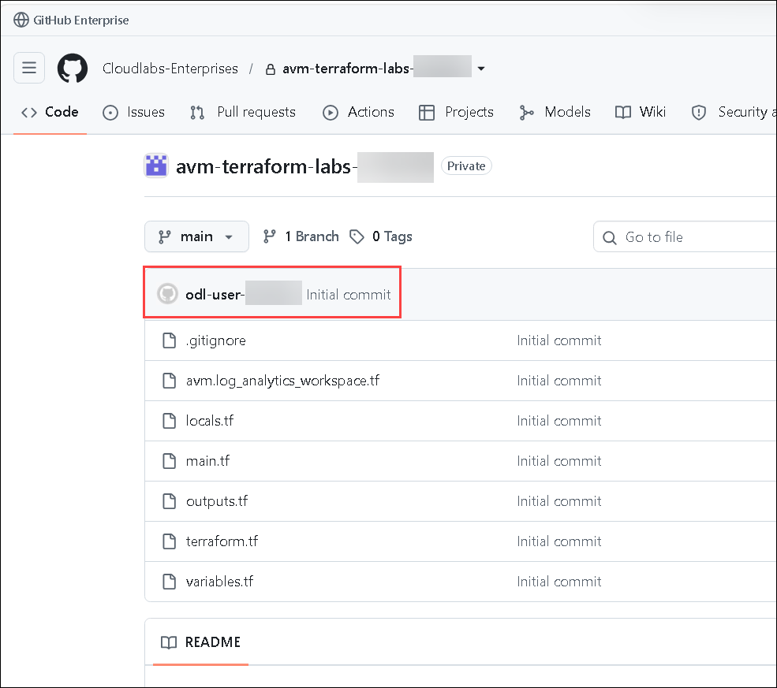

## Task 3 - Virtual network and subnets

In this part we are going to add a virtual network and subnets to our Terraform configuration by leveraging the Azure Verified Module for Virtual Network. The Virtual Network is going to be used to provide private connectivity between and to our virtual machine, key vault and storage account.

>IMPORTANT: This lab is incremental, you must not delete any files from the previous lab (especially the `terraform.tfstate` file). You must copy the files from the next lab into the `avm-lab` folder and only replace the existing files when prompted.

**Azure Networking Concepts:**

| Concept | Description |
|:--------|:------------|
| **Address Space** | The private IP CIDR block for the entire VNet (e.g. `10.0.0.0/22`). |
| **Subnet** | A logical subdivision of the VNet's address space. Resources are deployed into subnets. |
| **Region scope** | VNets exist within a single Azure region. |
| **CIDR Notation** | Specifies IP ranges using slash notation such as `/16` or `/24`. |

1. Copy the files from the **Part 2** folder into the `avm-lab` folder. This will add some new files and replace some files.

      ```pwsh
      copy ../labs/part02-virtual-network/* .
      ```

   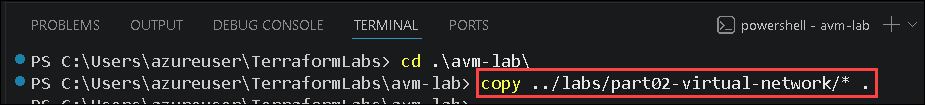

   -  Your file structure should now look like this if you have followed the instructions correctly (this structure will continue to grow as you progress through the lab):

      ```plaintext
      📂terraformlabs
      ┣ 📂avm-lab
      ┃ ┣ 📂.git (hidden)
      ┃ ┣ 📂.terraform
      ┃ ┣ 📜.gitignore
      ┃ ┣ 📜.terraform.lock.hcl
      ┃ ┣ 📜avm.log_analytics_workspace.tf
      ┃ ┣ 📜avm.nat_gateway.tf
      ┃ ┣ 📜avm.network_security_group.tf
      ┃ ┣ 📜avm.virtual_network.tf
      ┃ ┣ 📜locals.tf
      ┃ ┣ 📜main.tf
      ┃ ┣ 📜outputs.tf
      ┃ ┣ 📜terraform.tf
      ┃ ┣ 📜terraform.tfstate
      ┃ ┣ 📜terraform.tfvars
      ┃ ┣ 📜tfplan
      ┃ ┗ 📜variables.tf
      ```

1. Open the **terraform.tfvars (1)** file, update it with the following **code (2)**, and then save the file using `Ctrl + s`.

   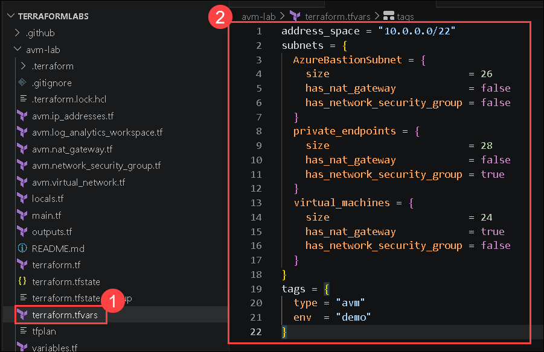

      ```hcl
      address_space = "10.0.0.0/22"
      subnets = {
        AzureBastionSubnet = {
          size                       = 26
          has_nat_gateway            = false
          has_network_security_group = false
        }
        private_endpoints = {
          size                       = 28
          has_nat_gateway            = false
          has_network_security_group = true
        }
        virtual_machines = {
          size                       = 24
          has_nat_gateway            = true
          has_network_security_group = false
        }
      }
      tags = {
        type = "avm"
        env  = "demo"
      }
      ```

1. Run the following command to initialize the Terraform configuration and install the Azure Verified Module (AVM) for Virtual Networks along with the required networking resources.

   ```
   terraform init
   ```

   - You should see: `Terraform has been successfully initialized!`

     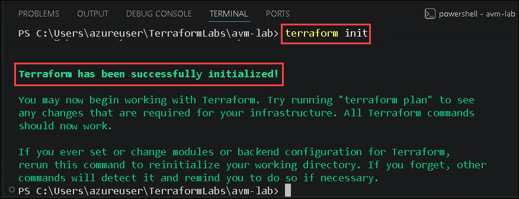

1. Open the **avm.ip_addresses.tf (1)** file and note the use of a utility module here, pay close attention to the **source and version (2)** properties. A utility module is a helper module that doesn't deploy anything itself, but is used to calculate common values.

   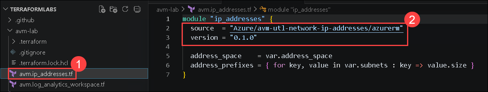

1. Open the **avm.virtual-network.tf (1)** file and look at each of the properties, paying close attention to the **source and version (2)** properties.

   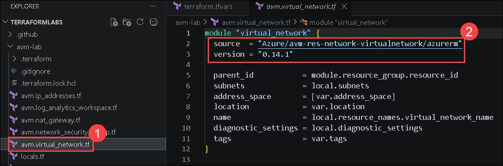

1. Examine the diagnostics settings in **locals.tf** and take note that this same setting will be applied to all of the AVM modules in the lab.

   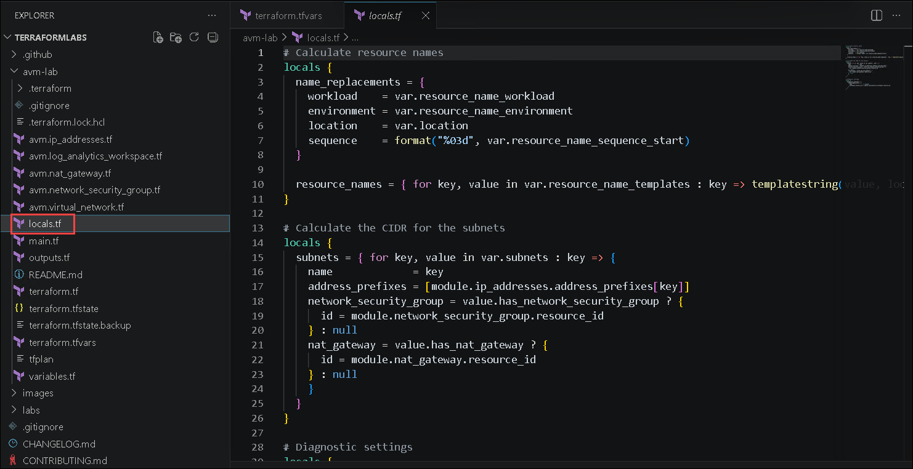

1. In order to find more detail about AVM modules, you can navigate to their documentation. For example, you can find the documentation for the Virtual Network module [here](https://registry.terraform.io/modules/Azure/avm-res-network-virtualnetwork/azurerm/latest). From there you can navigate to the source code and see the module's implementation [here](https://github.com/Azure/terraform-azurerm-avm-res-network-virtualnetwork).

1. Run the following command in the terminal to apply the Terraform configuration and deploy the Azure resources.

   ```
   terraform apply -auto-approve
   ```

   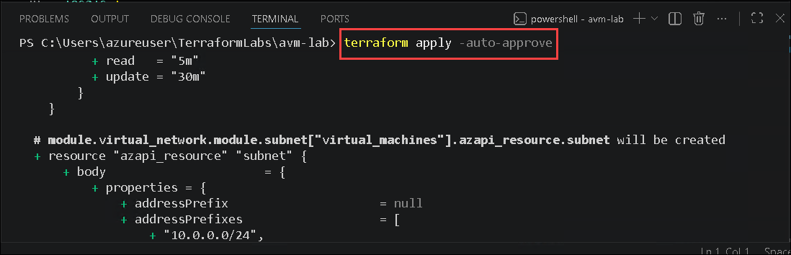

1. After the command completes successfully, you should see output similar to the following:

   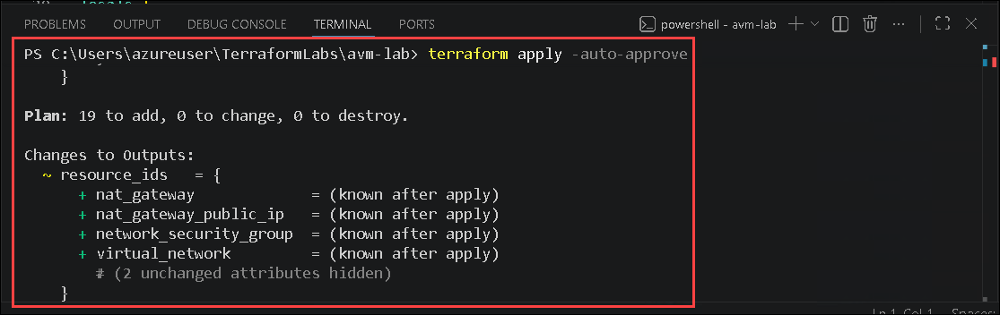
   
1. Review the deployed resources in the Azure portal. In the global search bar, type **Virtual network (1)**, and then select **Virtual networks (2)** from the search results.

   

1. Select the newly created **Virtual network**.

   

1. Review the **Virtual network** that was created as part of the Terraform deployment.

   

1. Navigate back to Visual Studio Code, and in the terminal, run the following command to commit the changes to the Git repository:

   ```
   git add .  
   git commit -m "Add virtual network and subnets"
   git push origin main
   ```

   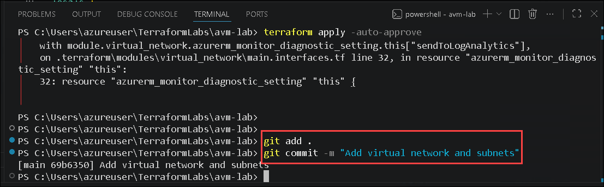

   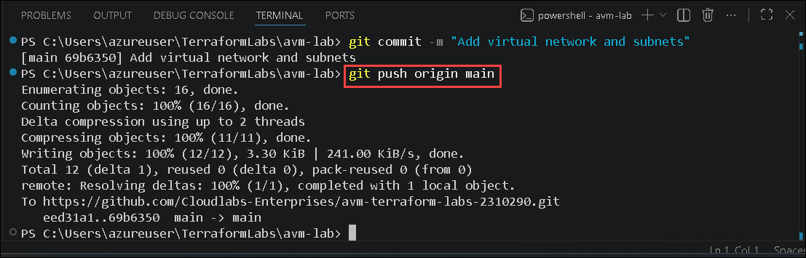

1. Review the files the GitHub repository.

   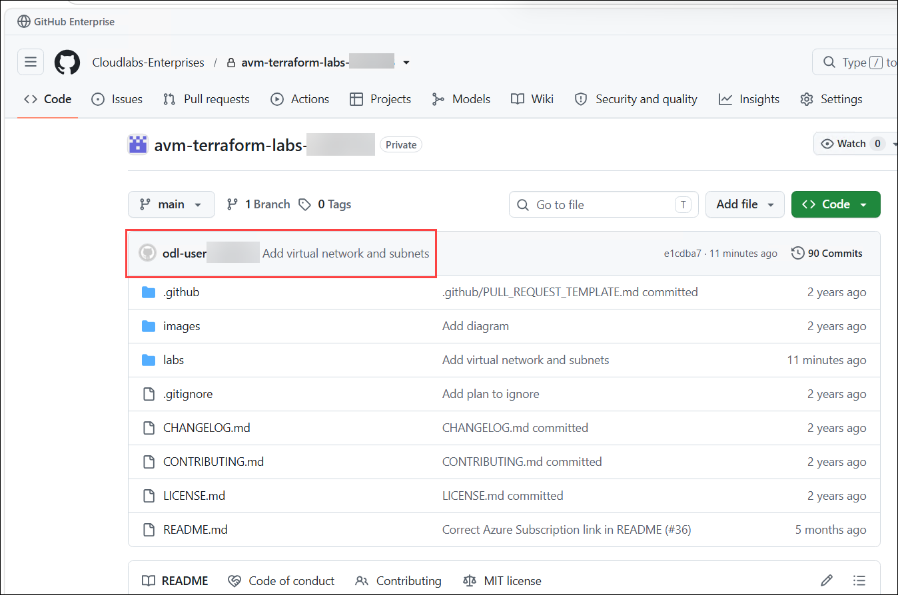

## Task 4 - Key Vault

In this part we are going to add a Key Vault to our Terraform configuration by leveraging the Azure Verified Module for Key Vault. The Key Vault is going to be used to store the customer managed key for our storage account and the SSH private key for our virtual machine.

1. Copy the files from the **Part 3** folder into the `avm-lab` folder, remembering to retain the existing files and just add and overwrite when prompted.

      ```pwsh
      copy ../labs/part03-key-vault/* .
      ```

      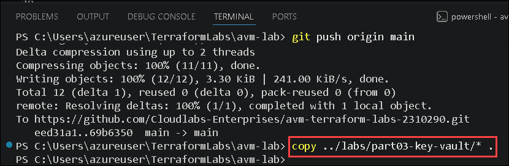  

1. Run the following command to initialize the Terraform configuration and install the Azure Verified Module (AVM) for Key Vault.

   ```
   terraform init
   ```

   - You should see: `Terraform has been successfully initialized!`

     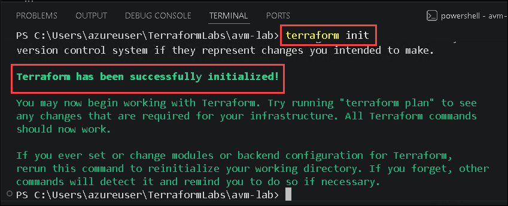

1. Open the **avm.key_vault.tf (1)** file and look at each of the properties, paying close attention to the **private_endpoints (2)** and **role_assignments (3)** variables.

   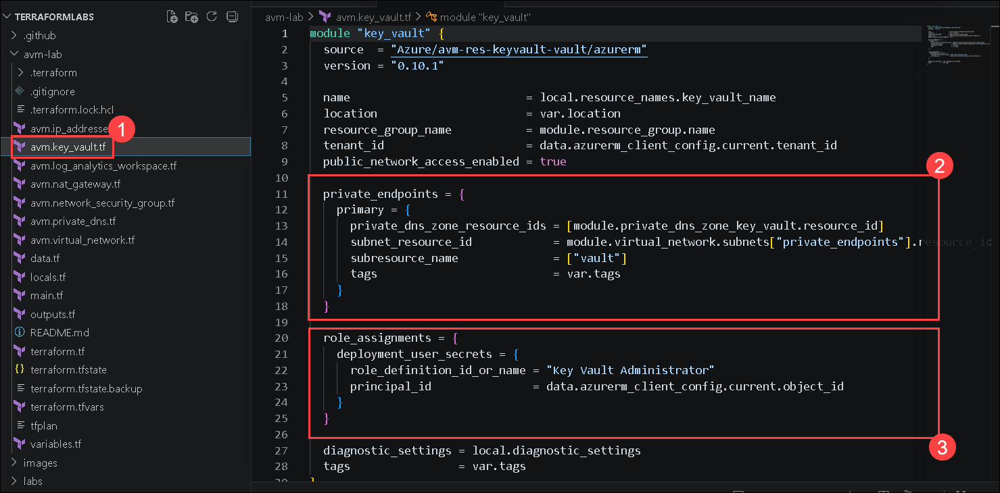

1. Run the following command to apply the Terraform configuration and deploy the Azure resources.

   ```
   terraform apply -auto-approve
   ```

   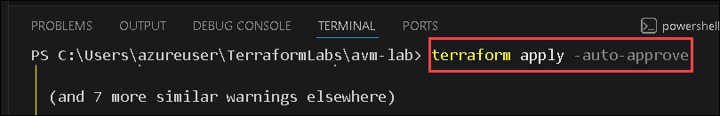

1. Navigate back to the Azure portal. In the search bar, type **Key vault (1)**, and then select **Key vaults (2)** from the search results to view the newly created resource.

   

1. Select the newly created Key vault, and review the resource.

   

1. Commit the changes to git: 

   ```
   git add .  
   git commit -m "Add key vault"
   git push origin main
   ```

   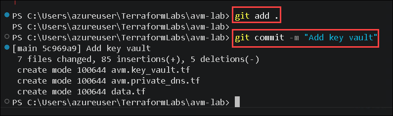

   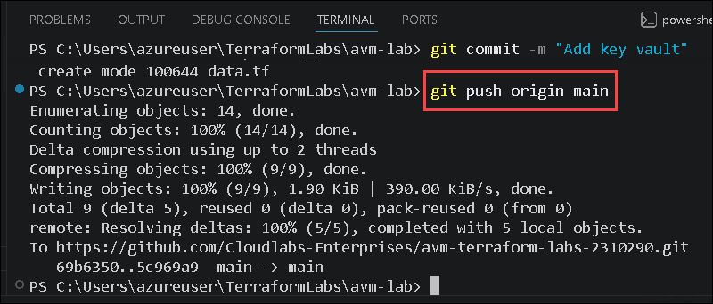
   
1. Review the files the GitHub repository.

   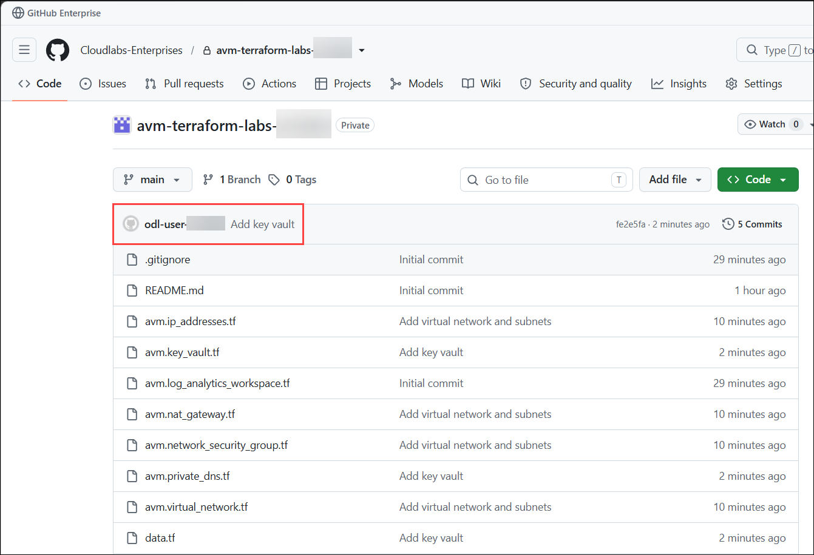

## Task 5 - Storage account

In this part we are going to add a Storage Account to our Terraform configuration by leveraging the Azure Verified Module for Storage Account. The Storage Account is the main component of our demo lab and we will interact with it later on.

1. Copy the files from the **Part 4** folder into the `avm-lab` folder, remembering to retain the existing files and just add and overwrite when prompted.

      ```pwsh
      copy ../labs/part04-storage-account/* .
      ```
   
      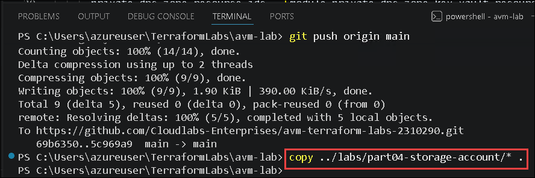

1. Run to install the AVM module for Storage Account.

   ```
   terraform init
   ```

   - You should see: `Terraform has been successfully initialized!`

     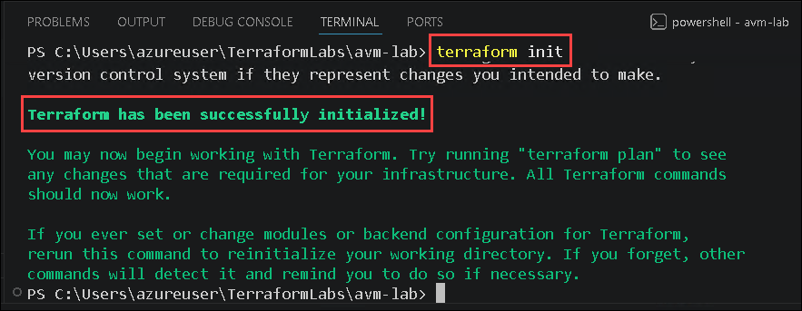

1. Open the **avm.storage-account.tf (1)** file and look at each of the **properties (2)**, paying close attention to the **managed_identities**, **customer_managed_key** and **containers** variables.

   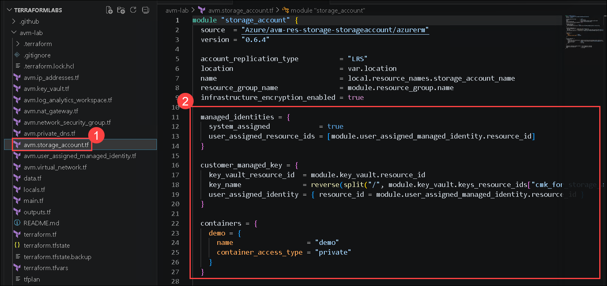

1. Note in the source control diff that we are adding a key to the Key Vault using the AVM module and assigning permissions for the user assigned managed identity to access the key.

1. Run the following command to apply the Terraform configuration and deploy the Azure resources.
   
   ```
   terraform apply -auto-approve
   ```

   

1. Navigate to the Azure portal. In the global search bar, type **Storage accounts (1)**, and then select **Storage accounts (2)** from the search results.

   

1. Select the **Storage account (1)** created by the Terraform deployment, and review its **details (2)**.

   

1. Commit the changes to git:

   ```
   git add .  
   git commit -m "Add storage account"
   git push origin main
   ```

   

   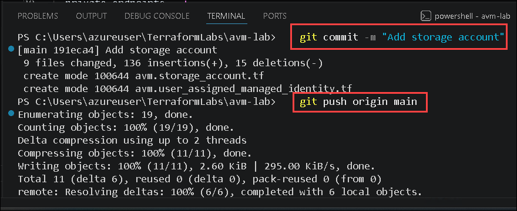

1. Review the files the GitHub repository.

   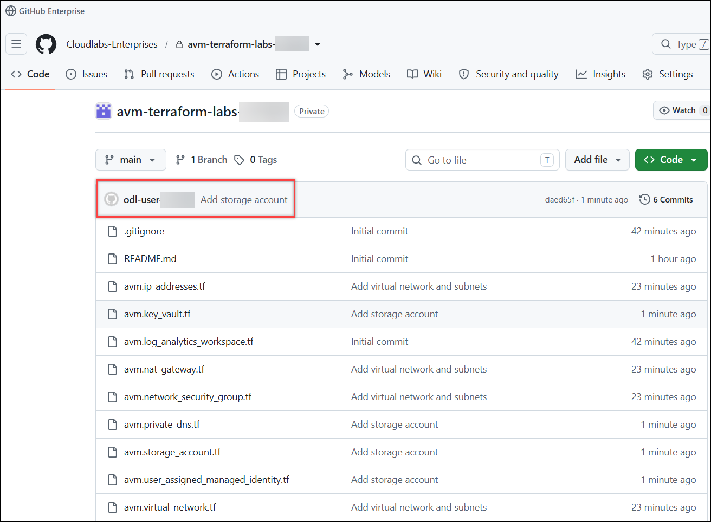

---

## 🧾 Summary

In this lab, you completed the following:

* Authenticated with Azure and configured the target subscription for the deployment.
* Initialized the Terraform configuration and deployed the foundational Azure infrastructure using Azure Verified Modules (AVM).
* Provisioned core Azure resources, including a Resource Group, Log Analytics Workspace, Virtual Network, Key Vault, and Storage Account.
* Validated the deployed resources in the Azure portal to confirm successful deployment.
* Tracked infrastructure changes by initializing a Git repository and committing the Terraform configuration after each deployment stage.

You have successfully completed the lab. Click **Next >>** in the lower-right corner to proceed to the next lab.

