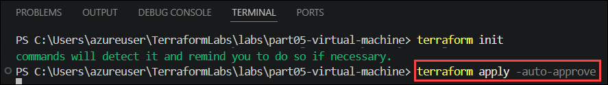
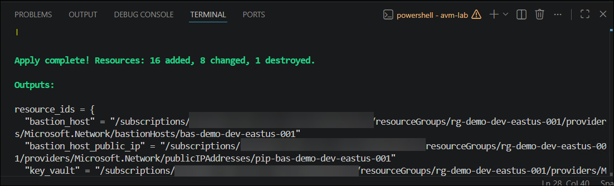
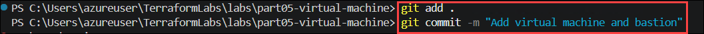
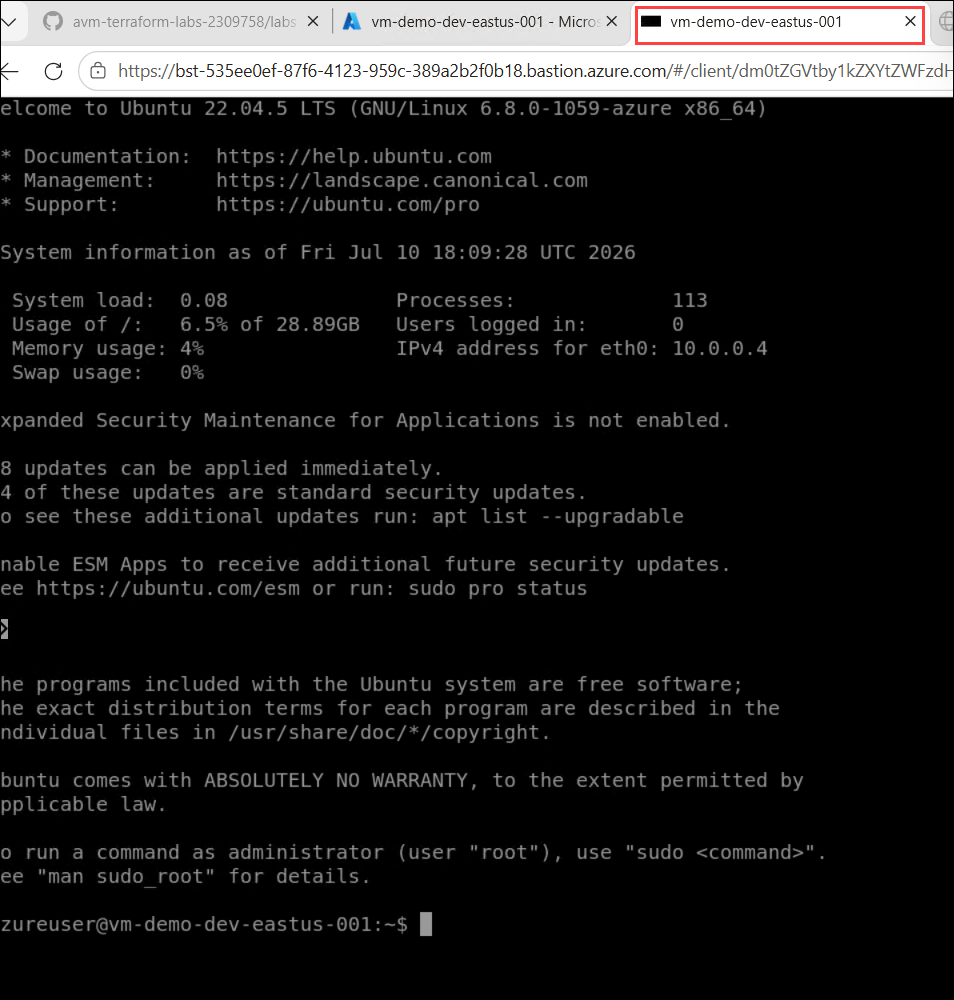

# Exercise 2: Deploy a Virtual Machine and Validate Secure Storage Access

### Estimated Duration: 30 Minutes

## 📘 Scenario


## 📖 Overview


## 🎯 Objectives

You will be able to complete the following tasks:

- Task 1 - Virtual machine and Bastion
- Task 2 - Connect to the VM via Bastion
- Task 3 - Install the Azure CLI and login
- Task 4 - Create a blob in the storage account

## Task 1 - Virtual machine and Bastion

In this part we are going to add a Virtual Machine to our Terraform configuration by leveraging the Azure Verified Module for Virtual Machine. The Virtual Machine is going to be used to interact with the Storage Account later. We are also going to add a role assignment to the storage module to assign permissions to the managed identity of the virtual machine to the storage container.

1. Copy the files from the **Part 5** folder into the `avm-lab` folder, remembering to retain the existing files and just add an overwrite when prompted.

      ```pwsh
      copy ../labs/part05-virtual-machine/* .
      ```

1. Add the following variables to the **terraform.tfvars (1)** file, and then save the **changes (2)** by pressing `Ctrl + S`.

   

      >NOTE: You may need to choose a different virtual machine sku depending on availability in your chosen region. If you are running this lab in Skillable, SKUs are restricted to names beginning with `Standard_B2*` or `Standard_D2*` only.

      ```hcl
      virtual_machine_sku = "Standard_D2s_v4"
      virtual_machine_image = {
        publisher = "Canonical"
        offer     = "0001-com-ubuntu-server-jammy"
        sku       = "22_04-lts-gen2"
        version   = "latest"
      }
      ```

1. Run the following command to initialize the Terraform configuration and install the Azure Verified Modules (AVMs) for the Virtual Machine and Role Assignments.

   ```pwsh
   terraform init   
   ```
   - You should see: `Terraform has been successfully initialized!`

        

1. Open the **avm.virtual_machine.tf (1)** file and look at each of the properties, paying close attention to the **generated_secrets_key_vault_secret_config (2)** and **network_interfaces (3)** variables.

       

1. Apply the changes with Terraform: 

   ```pwsh
   terraform apply -auto-approve   
   ```

   

   >**Note:** The deployment may take several minutes to complete, as the virtual machine and its associated resources are being provisioned. Please wait until the command finishes successfully.

   Expected output:

   ```
   Apply complete! Resources: 16 added, 8 changed, 1 destroyed.
   ```   

   

1. Navigate to the Azure portal. In the search bar, type **Virtual machines (1)**, and then select **Virtual machines (2)** from the search results.

   

1. Select the newly created **Virtual Machine (1)**, and review it's **Properties (2)**.

   

1. Commit the changes to git:

   ```
   git add .  
   git commit -m "Add virtual machine and bastion"
   git push origin main
   ```

   

## Task 2 - Connect to the VM via Bastion

In this part we are going to connect to the virtual machine via the Azure Bastion service using the SSH private key stored in the Key Vault.

1. Open the Azure portal. In the search bar, type **Virtual machine (1)**, and then select **Virtual machines (2)** from the search results.

   

1. On the Virtual machines page, select the Virtual machine that was deployed using Terraform.

    

1. On the **Overview (1)** page, click the drop-down arrow next to **Connect (2)**, and then select **Connect via Bastion (3)**.

    

1. Ensure that **SSH (1)** is selected as the Protocol, and then select **SSH Private Key from Azure Key Vault (3)** from the **Authentication Type (2)** drop-down menu.
   
   

1. Enter **azureuser (1)** in the Username field. Then, select the available **Subscription (2)**, **Azure Key Vault (3)**, and **Azure Key Vault Secret (4)** from their respective drop-down menus.

   

1. Clear the **Open in new browser tab (1)** checkbox, and then click **Connect (2).**

   

1. After you click **Connect**, the Virtual Machine opens in a new terminal session through Azure Bastion.

   

## Task 3 - Install the Azure CLI and login

We are going to install the Azure CLI and login with the system assigned managed identity of the VM from the Azure Bastion SSH terminal.

1. Run the following command to install the Azure CLI.

   ```bash
   curl -sL https://aka.ms/InstallAzureCLIDeb | sudo bash
   ```

   

1. Run to login with the system assigned managed identity.

   ```
   az login --identity
   ```

   

## Task 4 - Create a blob in the storage account

We are going to create a blob in the storage account using the Azure CLI form the Azure Bastion SSH terminal.

1. Run the following command to create a file named hello.txt with the content **"hello world"**. 

   ```
   echo "hello world" > hello.txt
   ```

   

1. Navigate to the Azure portal. In the global search bar, type **Storage accounts (1)**, and then select **Storage accounts (2)** from the search results.

   

1. Select the **Storage Account (1)**, copy the **Storage Account (2)** name , and save it in Notepad for use in the next steps.

   

   >**Note**: The storage account name may very.   

1. Run the following command to upload the **hello.txt** file to the storage account. Replace <storage-account-name> with the storage account name that you copied in **Step 3.**

   ```
   az storage blob upload --account-name <storage-account-name> --container-name demo --file hello.txt --name hello.txt --auth-mode login
   ```

   

1. Run the following command to list the blobs in the container. Replace <storage-account-name> with the storage account name you copied in **Step 3.**

   ```
   az storage blob list --account-name <storage-account-name> --container-name demo --auth-mode login
   ```

   

1. Run the following command to download the blob to a new file. Replace <storage-account-name> with the storage account name you copied in **Step 3.**

   ```
   az storage blob download --account-name <storage-account-name> --container-name demo --name hello.txt --file hello2.txt --auth-mode login
   ```

   

1. Run to view the contents of the downloaded file.

   ```
   cat hello2.txt
   ```

   

## 🧾 Summary

In this exercise, you completed the following:

* Configured Terraform to deploy an Azure Virtual Machine, Azure Bastion, and supporting infrastructure using Azure Verified Modules (AVMs)
* Created and configured the `terraform.tfvars` file with networking, tagging, and virtual machine settings
* Initialized and deployed the infrastructure using the Terraform `init` and `apply` workflow
* Verified the deployed Virtual Machine and associated resources in the Azure portal
* Connected securely to the Virtual Machine using Azure Bastion with an SSH private key stored in Azure Key Vault
* Installed the Azure CLI on the Virtual Machine and authenticated using its System Assigned Managed Identity
* Uploaded, listed, downloaded, and verified a blob in Azure Storage using Azure CLI with Managed Identity authentication, validating secure access without using storage account keys

## 🎉 Congratulations!

You have successfully completed all five Azure Verified Modules (AVM) Terraform labs!

Throughout this workshop, you used **Terraform** and **Azure Verified Modules (AVMs)** to provision and manage Azure infrastructure following **Infrastructure as Code (IaC)** principles. You deployed core Azure resources including **Resource Groups, Virtual Networks, Subnets, NAT Gateways, Network Security Groups, Log Analytics Workspaces, Key Vaults, Storage Accounts, Azure Bastion, and Linux Virtual Machines** using reusable, production-ready Terraform modules.

You also implemented secure infrastructure practices by integrating **Azure Key Vault** for secret management, enabling **Managed Identity** for passwordless authentication, and configuring **role-based access control (RBAC)** to securely access Azure Storage. Throughout the labs, you gained hands-on experience with Terraform workflows (`init`, `plan`, and `apply`), variables, outputs, modules, state management, and Azure resource dependencies while following best practices for **automation, modularity, scalability, security, and maintainability** on Microsoft Azure.

