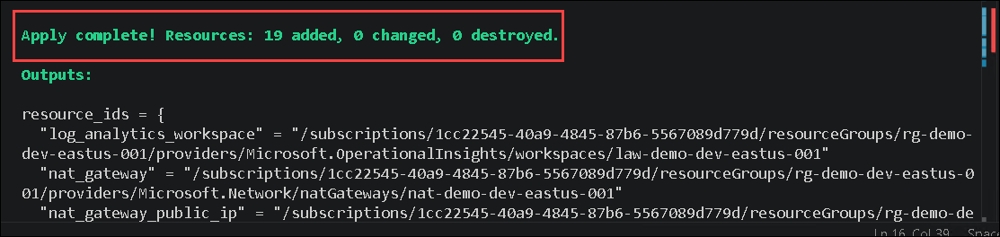
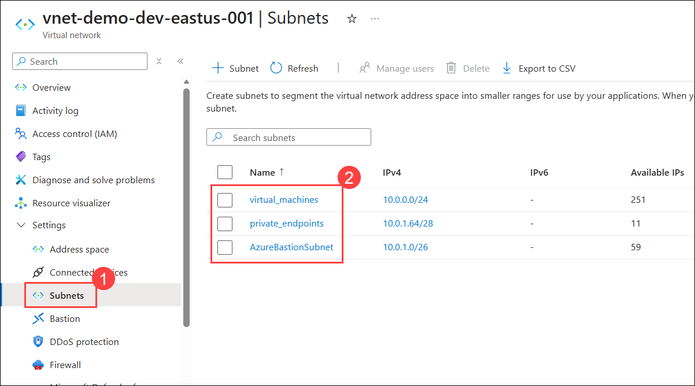
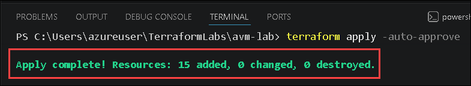
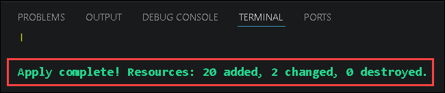
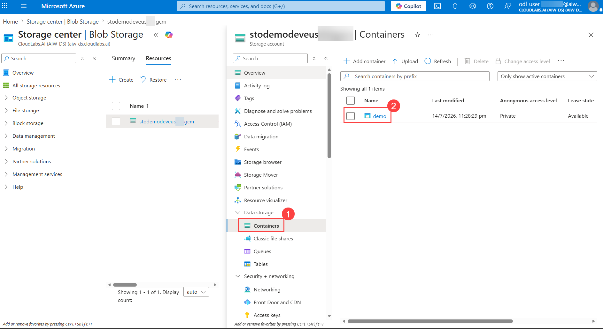
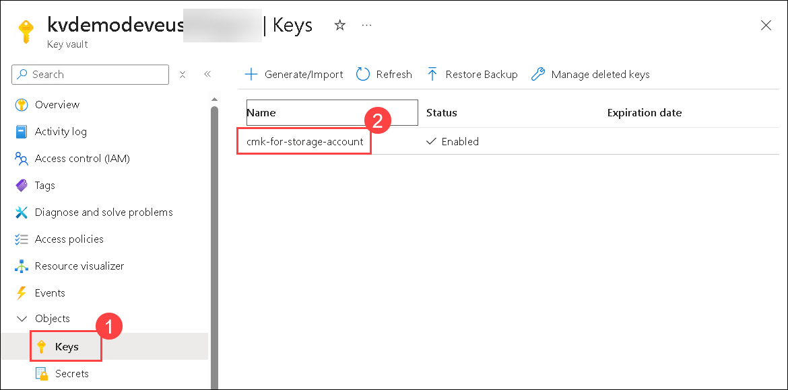

# Exercise 2: Building a Secure, Private Network Foundation with Azure Verified Modules

### Estimated Duration: 90 Minutes

## 📘 Scenario

Contoso, a growing financial services company, is modernizing its cloud infrastructure practices. After a recent security review, Contoso's leadership mandated that all new Azure workloads must be deployed using Infrastructure as Code, communicate over private networks rather than the public internet, and encrypt sensitive data with keys that Contoso controls. 

As a cloud engineer on Contoso's platform team, you have been tasked with building the secure network foundation for an upcoming workload. Rather than authoring every resource configuration from scratch, your team has standardized on Azure Verified Modules (AVM) — Microsoft-supported Terraform modules that encode Azure best practices out of the box. In this exercise, you will extend the Terraform configuration from the previous exercise to deploy a virtual network with purpose-built subnets, a Key Vault to safeguard Contoso's encryption keys and credentials, and a Storage Account secured with a customer-managed key — committing each incremental change to Contoso's GitHub repository as you go.


## 📖 Overview

In this exercise, you will incrementally build Contoso's secure, private network foundation on Azure using Terraform and Azure Verified Modules. You will begin by deploying a virtual network with a /22 address space, divided into dedicated subnets for Azure Bastion, private endpoints, and virtual machines — complete with a NAT gateway and network security group — while using an AVM utility module to calculate subnet address ranges automatically. Next, you will deploy an Azure Key Vault that is accessible only through a private endpoint with Private DNS Zone integration, and grant administrative access using Azure role-based access control (RBAC). 

Finally, you will deploy a Storage Account that authenticates through a managed identity, encrypts data at rest with a customer-managed key stored in the Key Vault, and hosts a private blob container. Throughout the exercise, a reusable diagnostic settings configuration will send logs and metrics from every resource to a central Log Analytics Workspace, and you will commit each change to a GitHub repository, following real-world Infrastructure as Code workflows.

## 🎯 Objectives

In this exercise, you will complete the following tasks:

- Task 1: Configure the Virtual Network and Subnets
- Task 2: Deploy the Key Vault
- Task 3: Deploy the Storage Account

## Task 1: Configure the Virtual Network and Subnets

In this task, you will add a Virtual Network and subnets to your Terraform configuration using the Azure Verified Module (AVM) for Virtual Network. The Virtual Network provides secure, private connectivity between the virtual machine, Key Vault, and Storage Account.

>IMPORTANT: This lab is incremental, you must not delete any files from the previous lab (especially the `terraform.tfstate` file). You must copy the files from the next lab into the `avm-lab` folder and only replace the existing files when prompted.

**Azure Networking Concepts:**

| Concept | Description |
|:--------|:------------|
| **Address Space** | The private IP CIDR block for the entire VNet (e.g. `10.0.0.0/22`). |
| **Subnet** | A logical subdivision of the VNet's address space. Resources are deployed into subnets. |
| **Region scope** | VNets exist within a single Azure region. |
| **CIDR Notation** | Specifies IP ranges using slash notation such as `/16` or `/24`. |

1. Run the following command to copy the files from the **Part 2** folder into the **avm-lab** folder. This will add new files and overwrite existing files where applicable.

      ```pwsh
      copy ../labs/part02-virtual-network/* .
      ```

   

   -  Your file structure should now look like this if you have followed the instructions correctly (this structure will continue to grow as you progress through the lab):

      ```plaintext
      📂terraformlabs
      ┣ 📂avm-lab
      ┃ ┣ 📂.git (hidden)
      ┃ ┣ 📂.terraform
      ┃ ┣ 📜.gitignore
      ┃ ┣ 📜.terraform.lock.hcl
      ┃ ┣ 📜avm.log_analytics_workspace.tf
      ┃ ┣ 📜avm.nat_gateway.tf
      ┃ ┣ 📜avm.network_security_group.tf
      ┃ ┣ 📜avm.virtual_network.tf
      ┃ ┣ 📜locals.tf
      ┃ ┣ 📜main.tf
      ┃ ┣ 📜outputs.tf
      ┃ ┣ 📜terraform.tf
      ┃ ┣ 📜terraform.tfstate
      ┃ ┣ 📜terraform.tfvars
      ┃ ┣ 📜tfplan
      ┃ ┗ 📜variables.tf
      ```

1. Open the **terraform.tfvars (1)** file, replace it with the following **code (2)**, and then save the file using `Ctrl + s`.

   

      ```hcl
      address_space = "10.0.0.0/22"
      subnets = {
        AzureBastionSubnet = {
          size                       = 26
          has_nat_gateway            = false
          has_network_security_group = false
        }
        private_endpoints = {
          size                       = 28
          has_nat_gateway            = false
          has_network_security_group = true
        }
        virtual_machines = {
          size                       = 24
          has_nat_gateway            = true
          has_network_security_group = false
        }
      }
      tags = {
        type = "avm"
        env  = "demo"
      }
      ```
   
   | Configuration | Description |
   |:--------|:------------|
   | `AzureBastionSubnet` | Creates a dedicated subnet for the Azure Bastion service. |
   | `size = 26` | Allocates a /26 subnet address range for Azure Bastion. |
   | `private_endpoints` | Creates a subnet for hosting Azure Private Endpoints. |
   | `virtual_machines` | Creates a subnet for deploying Virtual Machines. |
   | `has_network_security_group = true` | Associates a Network Security Group (NSG) with the Private Endpoints subnet. |

1. Run the following command to initialize the Terraform configuration and install the Azure Verified Module (AVM) for Virtual Networks along with the required networking resources.

   ```
   terraform init
   ```

   - You should see: `Terraform has been successfully initialized!`

     

1. Open the **avm.ip_addresses.tf (1)** file and note the use of a utility module here, pay close attention to the **source and version (2)** properties. A utility module is a helper module that doesn't deploy anything itself, but is used to calculate common values.

   

   | Configuration | Description |
   |:--------|:------------|
   | `source` | Specifies the Terraform Registry location of the Azure Verified Utility Module (AVM Utility) that Terraform downloads to calculate IP address ranges and subnet prefixes. |
   | `version` | Specifies the version of the utility module to use, ensuring a consistent and predictable deployment by avoiding unexpected changes from newer module versions. |

1. Open the **avm.virtual_network.tf (1)** file and look at each of the properties, paying close attention to the **source and version (2)** properties.

   

   | Configuration | Description |
   |:--------|:------------|
   | `source` | Specifies the Terraform Registry location of the Azure Verified Module (AVM) that Terraform downloads and uses to deploy the Azure Virtual Network. |
   | `version` | Specifies the version of the Azure Verified Module to use, ensuring a consistent and predictable deployment by avoiding unexpected changes from newer module versions. |

1. Examine the diagnostic settings in **locals.tf** and take note that this same setting will be applied to all of the AVM modules in the lab.

   

   | Configuration | Description |
   |:--------|:------------|
   | `diagnostic_settings` | Defines the diagnostic settings that are applied to Azure resources to collect logs and metrics. |
   | `Log Analytics Workspace` | Configures Azure resources to send their diagnostic logs and metrics to the deployed Log Analytics Workspace for centralized monitoring. |
   | `Reusable Local Value` | Stores the diagnostic settings as a local value so the same configuration can be reused across multiple Azure Verified Modules (AVMs), ensuring consistent monitoring for all deployed resources. |

1. In order to find more detail about AVM modules, you can navigate to their documentation. For example, you can find the documentation for the Virtual Network module [here](https://registry.terraform.io/modules/Azure/avm-res-network-virtualnetwork/azurerm/latest). From there you can navigate to the source code and see the module's implementation [here](https://github.com/Azure/terraform-azurerm-avm-res-network-virtualnetwork).

1. Run the following command in the terminal to apply the Terraform configuration and deploy the Azure resources.

   >**Note:** This command applies the Terraform configuration and automatically approves the deployment without prompting for confirmation.

   ```
   terraform apply -auto-approve
   ```

   >**Note:** The command may take a few minutes to complete. Please wait until it finishes before proceeding.

   

   Expected output:

   ```
   Apply complete! Resources: 19 added, 0 changed, 0 destroyed.
   ```

   

1. After the command completes successfully, you should see output similar to the following:

   

   >**Note**: Scroll up in the **Terminal** to view the command output.
   
1. Review the deployed resources in the Azure portal. In the global search bar, type **Virtual network (1)**, and then select **Virtual networks (2)** from the search results.

   

1. Select the newly created **Virtual Network** deployed using Terraform.

   

1. Review the **Virtual network** that was created as part of the Terraform deployment.

   

1. Under Settings, click **Subnets (1)**, and review the subnet **details (2)**.

   

1. Navigate back to Visual Studio Code, and in the terminal, run the following command to commit the changes to the Git repository:

   ```
   git add .
   ```

   ```
   git commit -m "Add virtual network and subnets"
   ```
   
   ```
   git push origin main
   ```

   

   

1. Refresh the **GitHub repository** page, and review the files in the repository.

   

   > **Congratulations** on completing the task! Now, it's time to validate it. Here are the steps:
   >
   > - Scroll down and hit the Validate button in the lab guide for the corresponding task. If you receive a success message, you can proceed to the next task.
   > - If not, carefully read the error message and retry the step, following the instructions in the lab guide.
   > - If you need any assistance, please contact us at cloudlabs-support@spektrasystems.com. We are available 24/7 to help.

   <validation step="114c82cf-568c-4650-b1bc-cee8b149bc72" />

## Task 2: Deploy the Key Vault

In this part we are going to add a Key Vault to our Terraform configuration by leveraging the Azure Verified Module for Key Vault. The Key Vault is going to be used to store the customer managed key for our storage account and the SSH private key for our virtual machine.

1. Run the following command to copy the files from the **Part 3** folder into the **avm-lab** folder.

      ```pwsh
      copy ../labs/part03-key-vault/* .
      ```

        

1. Run the following command to initialize the Terraform configuration and install the Azure Verified Module (AVM) for Key Vault.

   ```
   terraform init
   ```

   - You should see: `Terraform has been successfully initialized!`

     

1. Open the **avm.key_vault.tf (1)** file and look at each of the properties, paying close attention to the **private_endpoints (2)** and **role_assignments (3)** variables.

   

   | Configuration | Description |
   |:--------|:------------|
   | `private_endpoints` | Configures a Private Endpoint for the Key Vault, allowing it to be accessed securely over the Virtual Network instead of the public internet. |
   | `Private DNS Zone` | Links the Private Endpoint to a Private DNS Zone, enabling the Key Vault name to resolve to its private IP address. |
   | `Subnet Association` | Deploys the Private Endpoint into the private_endpoints subnet of the Virtual Network. |
   | `role_assignments` | Assigns Azure Role-Based Access Control (RBAC) permissions to users or identities for the Key Vault. |
   | `Key Vault Administrator` | Grants the specified user or identity full administrative permissions to manage the Key Vault, including keys, secrets, and certificates. |

1. Run the following command to apply the Terraform configuration and deploy the Azure resources.

   >**Note:** This command applies the Terraform configuration and automatically approves the deployment without prompting for confirmation.

   ```
   terraform apply -auto-approve
   ```

   >**Note:** The command may take a few minutes to complete. Please wait until it finishes before proceeding.

   

   Expected output:

   ```
   Apply complete! Resources: 15 added, 0 changed, 0 destroyed.
   ```

   

1. After the command completes successfully, you should see output similar to the following:

   

   >**Note**: Scroll up in the **Terminal** to view the command output.

1. Navigate back to the Azure portal. In the search bar, type **Key vault (1)**, and then select **Key vaults (2)** from the search results to view the newly created resource.

   

1. Select the newly created Key vault, and review the resource.

   

1. Commit the changes to git: 

   ```
   git add .
   ```
   
   ```
   git commit -m "Add key vault"
   ```
   
   ```
   git push origin main
   ```

   

   
   
1. Refresh the **GitHub repository** page, and review the files in the repository.

   

   > **Congratulations** on completing the task! Now, it's time to validate it. Here are the steps:
   >
   > - Scroll down and hit the Validate button in the lab guide for the corresponding task. If you receive a success message, you can proceed to the next task.
   > - If not, carefully read the error message and retry the step, following the instructions in the lab guide.
   > - If you need any assistance, please contact us at cloudlabs-support@spektrasystems.com. We are available 24/7 to help.
   
    <validation step="5529693a-b361-4be5-8e2b-b03b6e9c5954" />

## Task 3: Deploy the Storage Account

In this part we are going to add a Storage Account to our Terraform configuration by leveraging the Azure Verified Module for Storage Account. The Storage Account is the main component of our demo lab and we will interact with it later on.

1. Run the following command to copy the files from the **Part 4** folder into the **avm-lab** folder. 

      ```pwsh
      copy ../labs/part04-storage-account/* .
      ```
   
      

1. Run the following command to install the AVM module for the Storage Account.

   ```
   terraform init
   ```

   - You should see: `Terraform has been successfully initialized!`

     

1. Open the **avm.storage_account.tf (1)** file and look at each of the **properties (2)**, paying close attention to the **managed_identities**, **customer_managed_key** and **containers** variables.

   

   | Configuration | Description |
   |:--------|:------------|
   | `managed_identities` | Configures managed identities for the Storage Account, allowing it to securely authenticate with other Azure services without storing credentials. |
   | `customer_managed_key` | Configures the Storage Account to use a customer-managed encryption key stored in Azure Key Vault instead of the default Microsoft-managed key. |
   | `containers` | Creates blob containers within the Storage Account and defines their access level. In this configuration, a private container named demo is created. |

1. Run the following command to apply the Terraform configuration and deploy the Azure resources.

   >**Note:** This command applies the Terraform configuration and automatically approves the deployment without prompting for confirmation.
   
   ```
   terraform apply -auto-approve
   ```

   >**Note:** The command may take a few minutes to complete. Please wait until it finishes before proceeding.   

   

   Expected output:

   ```
   Apply complete! Resources: 20 added, 2 changed, 0 destroyed.
   ```

   

1. After the command completes successfully, you should see output similar to the following:

   

   >**Note**: Scroll up in the **Terminal** to view the command output.

1. Navigate to the Azure portal. In the global search bar, type **Storage accounts (1)**, and then select **Storage accounts (2)** from the search results.

   

1. Select the **Storage account (1)** created by the Terraform deployment, and review its **details (2)**.

   

1. Under **Data storage**, select **Containers (1)** to view the **demo (2)** container.

   

1. You can also view the key that is created when the **Storage Account** is deployed and stored in the **Key Vault**. In the Azure portal, navigate to your **Key Vault**, and under **Objects**, click **Keys (1)** to view the **generated key (2).**

   

1. Commit the changes to git:

   ```
   git add .
   ```
   ```
   git commit -m "Add storage account"
   ```
   
   ```
   git push origin main
   ```
   
   

   

1. Refresh the **GitHub repository** page, and review the files in the repository.

   

   > **Congratulations** on completing the task! Now, it's time to validate it. Here are the steps:
   >
   > - Scroll down and hit the Validate button in the lab guide for the corresponding task. If you receive a success message, you can proceed to the next task.
   > - If not, carefully read the error message and retry the step, following the instructions in the lab guide.
   > - If you need any assistance, please contact us at cloudlabs-support@spektrasystems.com. We are available 24/7 to help.    

    <validation step="3d6811ed-72be-4351-9ac8-4fd43867bcae" />

## 🧾 Summary

In this exercise, you completed the following:

* Deployed a Virtual Network with dedicated subnets for Azure Bastion, Private Endpoints, and Virtual Machines using the Azure Verified Module (AVM) for Virtual Network.
* Used an AVM utility module to automatically calculate IP address ranges and subnet prefixes from the defined address space.
* Deployed an Azure Key Vault secured with a Private Endpoint, Private DNS Zone integration, and RBAC role assignments.
* Deployed a Storage Account configured with a managed identity, customer-managed key encryption, and a private blob container.
* Applied consistent diagnostic settings across all resources, sending logs and metrics to a central Log Analytics Workspace.
* Validated the deployed resources in the Azure portal to confirm successful deployment.
* Tracked infrastructure changes by committing the Terraform configuration to the GitHub repository after each deployment stage.

---

You have successfully completed the lab. Click **Next >>** in the lower-right corner to proceed to the next lab.

